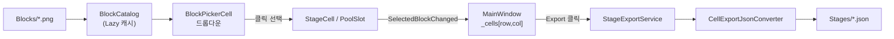

# StageMaker

3-Match 퍼즐 게임의 **스테이지(맵) 제작 툴**입니다. 9×9 Grid 위에 블록 이미지를 배치하고, 그 결과를 게임 클라이언트가 그대로 읽는 `Stages/*.json` 포맷으로 Export합니다.

- 기획자/QA가 코드를 몰라도 스테이지를 만들 수 있게 하는 **내부 개발 도구(Internal Tool)** 관점에서 설계했습니다.
- 개인 사이드 프로젝트로, WPF 커스텀 컨트롤 설계와 도메인 모델 ↔ 파일 포맷 분리에 초점을 맞췄습니다.

## 목차

- [주요 기능](#주요-기능)
- [개발 환경](#개발-환경)
- [아키텍처](#아키텍처)
- [설계 포인트](#설계-포인트)
- [Export 포맷](#export 기능)
- [실행 방법](#실행-방법)

## 주요 기능

| 기능 | 설명 |
|---|---|
| 그리드 크기 조절 | Row/Col 값을 직접 입력해 N×M 그리드로 즉시 재구성 |
| 블록 배치 | 셀 클릭 → `Blocks/` 폴더의 모든 이미지를 썸네일 드롭다운으로 표시 → 클릭 한 번으로 배치 |
| Random Fill 팔레트 | 별도 팔레트에 후보 블록을 등록해두면, 빈 셀을 그 후보 중 무작위로 자동 채움 |
| Export | 현재 그리드 상태를 `Stages/*.json` 포맷 그대로 저장 (기존 스테이지 파일들과 바이트 단위 호환) |

## 개발 환경

| 항목 | 내용 |
|---|---|
| 언어/런타임 | C# / .NET 8.0 (`net8.0-windows`) |
| UI 프레임워크 | WPF (`UseWPF=true`), Code-First 커스텀 컨트롤 |
| 직렬화 | `System.Text.Json` + 커스텀 `JsonConverter` |
| 빌드 | [StageMaker.sln](StageMaker.sln) → [src/StageMaker/StageMaker.csproj](src/StageMaker/StageMaker.csproj) |

## 아키텍처

```
StarWay-StageMaker/
├─ Blocks/                 # 블록 이미지 리소스 (*.png) — 런타임에 스캔되는 데이터 소스
├─ Stages/                 # Export 결과물 (*.json)
├─ Template.png            # 9x9 Grid 레이아웃 참고 이미지
└─ src/StageMaker/
   ├─ Models/               # 순수 데이터 모델 (뷰/서비스 의존성 없음)
   │  ├─ BlockDefinition.cs      # 블록 리소스 1건 (record)
   │  └─ StageExportModel.cs     # Stages/*.json 스키마와 1:1 대응하는 DTO
   ├─ Services/             # 파일 I/O, 캐싱, 직렬화 등 도메인 로직
   │  ├─ ProjectPaths.cs          # 레포 루트(Blocks/Stages) 탐색
   │  ├─ BlockCatalog.cs          # Blocks/ 스캔 결과 캐싱
   │  ├─ StageExportService.cs    # 그리드 상태 → Export 모델 → JSON
   │  └─ CellExportJsonConverter.cs  # 레거시 포맷 호환용 커스텀 컨버터
   ├─ Controls/             # 재사용 가능한 커스텀 WPF 컨트롤
   │  ├─ BlockPickerCell.cs       # 드롭다운 선택 UI의 공통 동작 (abstract base)
   │  ├─ StageCell.cs             # 9x9 그리드의 셀
   │  └─ PoolSlot.cs              # Random Fill 팔레트 슬롯
   └─ MainWindow.xaml(.cs)   # 레이아웃 정의 + 이벤트 오케스트레이션 (Code-behind)
```

**데이터 흐름**



레이어 책임을 명확히 나눴습니다.

- **Models**: WPF/파일 I/O를 전혀 모르는 순수 데이터. `StageExportModel`은 실제 게임이 읽는 JSON 스키마와 1:1로 매핑됩니다.
- **Services**: 정적 클래스 기반 도메인 로직. 상태를 갖지 않거나(`ProjectPaths`), 한 번 계산한 결과를 캐싱만 하는(`BlockCatalog`) 단순한 책임으로 제한했습니다.
- **Controls**: MainWindow와 완전히 독립적으로 동작하는 커스텀 컨트롤. `SelectedBlockChanged` 이벤트만으로 상위와 통신합니다.
- **MainWindow**: 위 세 레이어를 조립하고 사용자 입력을 라우팅하는 오케스트레이터. 도메인 로직을 직접 갖지 않도록 의식적으로 제한했습니다.

## 설계 포인트

### 1. 템플릿 메서드 활용

```csharp
// Controls/BlockPickerCell.cs
public abstract class BlockPickerCell : Border
{
    public BlockDefinition? SelectedBlock { get; private set; }
    public event EventHandler? SelectedBlockChanged;

    // 드롭다운 구성, 썸네일 캐싱, 선택 적용 로직은 여기 한 곳에만 존재한다.
    protected virtual string DescribeSelection(BlockDefinition block)
        => $"{block.Id} ({block.FileName})";
    ...
}

// Controls/StageCell.cs — Row/Col 정보만 추가하고 툴팁 문구만 오버라이드
public sealed class StageCell : BlockPickerCell
{
    public int Row { get; }
    public int Col { get; }

    protected override string DescribeSelection(BlockDefinition block)
        => $"({Row}, {Col}) - {block.Id} ({block.FileName})";
}

// Controls/PoolSlot.cs — 크기/배경만 다르고 로직은 그대로 재사용
public sealed class PoolSlot : BlockPickerCell
{
    public PoolSlot(BlockDefinition? defaultBlock = null)
    {
        Width = Height = 56;
        if (defaultBlock is not null) SetInitialSelection(defaultBlock);
    }
}
```

썸네일 비트맵 역시 `BlockPickerCell` 내부의 정적 `Dictionary<string, BitmapImage>`에 캐싱해, 같은 블록이 그리드 곳곳에서 선택될 때마다 디코딩을 반복하지 않도록 했습니다.

### 2. 도메인 모델(UI)과 Export DTO를 분리

`StageCell`이 들고 있는 `SelectedBlock`(런타임 UI 상태)과 `Stages/*.json`에 쓰이는 `CellExport`(파일 포맷)는 의도적으로 다른 타입입니다. UI 상태가 파일 포맷에 종속되면, 나중에 파일 스키마가 바뀔 때 컨트롤 코드까지 건드려야 하기 때문입니다. 변환은 `StageExportService` 한 곳에서만 일어납니다.

```csharp
// Services/StageExportService.cs
public static StageExportModel BuildExportModel(
    StageCell[,] cells, string stageName, IReadOnlyList<BlockDefinition> randomFillPool)
{
    ...
    for (int col = 0; col < colCount; col++)
    {
        var block = cells[row, col].SelectedBlock ?? PickRandomFillBlock(randomFillPool);
        rowCells.Add(block is null ? null : new CellExport { Block = new BlockExport { Type = block.Id } });
    }
    ...
}
```

### 3. 이벤트 기반 통신으로 컨트롤 ↔ 윈도우 결합도 낮추기

`BlockPickerCell`은 `MainWindow`의 존재를 전혀 모릅니다. 선택이 바뀌면 `SelectedBlockChanged` 이벤트만 올리고, `MainWindow`가 필요한 셀에만 구독해 상태바를 갱신합니다. 컨트롤을 다른 창/도구에 재사용하더라도 코드 변경이 필요 없습니다.

```csharp
// MainWindow.xaml.cs
var cell = new StageCell(row, col);
cell.SelectedBlockChanged += Cell_SelectedBlockChanged;
```

## Export 기능

`Stages/*.json`은 실제 게임 클라이언트가 로드하는 포맷이며, `Header`/`Cells`만 이 툴에서 실질적으로 채워지고 나머지(`Clears`/`Components`/`Genesises`/`Zones`)는 기존 파일과 구조를 맞추기 위한 자리표시자로 남겨뒀습니다([StageExportModel.cs](src/StageMaker/Models/StageExportModel.cs) 주석 참고).

```json
{
  "header": { "name": "normal_1", "rowCount": 4, "colCount": 4, "...": "..." },
  "clears": [], "components": {}, "genesises": [], "zones": [],
  "cells": [
    [{"block":{"type":"101"}}, {"block":{"type":"104"}}]
  ]
}
```

## 실행 방법

```powershell
dotnet build StageMaker.sln
dotnet run --project src/StageMaker/StageMaker.csproj
또는 exe 파일을 통한 실행
```

레포 루트의 `Blocks/`, `Stages/` 폴더를 자동으로 찾아 사용합니다([ProjectPaths.cs](src/StageMaker/Services/ProjectPaths.cs)) — 빌드 출력 위치와 무관하게 항상 같은 폴더를 읽고 씁니다.
