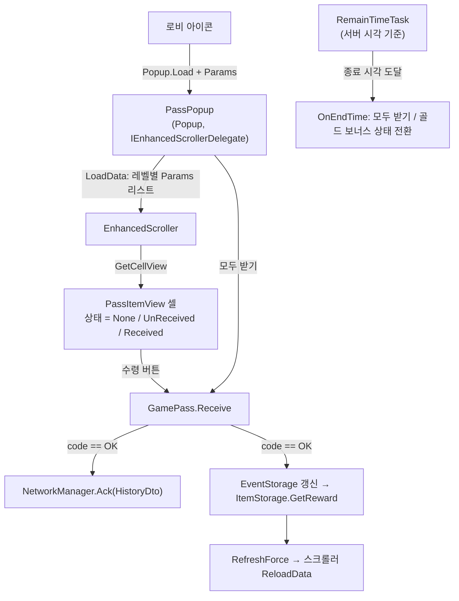

시즌 패스(Pass) 이벤트 — 서버가 결정하고 클라이언트는 미러링하는 보상 UI
=====================================================================
> 레벨을 올릴 때마다 **무료 보상 / 프리미엄 보상**을 받는 시즌제 이벤트다. 재접속률을 높이기 위한 이벤트 시스템(일일 출석, 미션, 패스) 중 하나로,
> 클라이언트는 **보상 트랙 UI, 수령 요청, 이벤트 종료 처리**를 맡는다. 수령 가능 여부의 최종 판단은 서버이고,
> 클라이언트는 응답을 받은 뒤에만 로컬 저장소(`EventStorage`)와 화면을 갱신한다.

샘플 코드 (실제 프로젝트에서 그대로 가져옴)
> [`PassPopup.cs`](./PassPopup.cs) — 팝업 본체, 스크롤러 델리게이트, 종료 카운트다운, 모두 받기 · [`PassItemView.cs`](./PassItemView.cs) — 레벨 한 줄(무료/프리미엄 보상) 셀, 개별 수령 ·
> [`PassOpenNoticePopup.cs`](./PassOpenNoticePopup.cs) — 패스 오픈 안내 팝업("오늘 하루 보지 않기" 토글, 종료 시각이 지나면 자동으로 닫힘) · [`PassDescriptionModal.cs`](./PassDescriptionModal.cs) — 박스 보상 내용 설명 모달

---

구조 한눈에 보기
------------------

> 팝업 공통 골격(`Popup.Load`, `Params`/`Result`, `OnOpen`)은 [PopupUIPattern.md](../PopupUIPattern.md), 서버 보상 확정 프로토콜(Ack)은 [IAPProcess.md](../IAPProcess.md) 와 같은 방식이다.

1. 열기 — 텍스처가 준비되기 전에는 보여주지 않는다
------------------------------------------------
패스 화면은 배너, 아이콘, 배경 3종, 무한 골드 영역 등 **서버 리소스 텍스처를 여러 장 내려받아** 그린다. 절반만 그려진 화면이 보이지 않도록
`OnOpen` 은 먼저 화면을 화면 밖으로 치우고(`HideUI`) 로딩 인디케이터를 켠 다음, 준비가 끝나면 보여준다(`ShowUI`).
```csharp
private void HideUI()
{
    LoadingIndicator.Show();
    RectTransform rect = GetComponent<RectTransform>();
    rect.localPosition = new Vector3(100000, 0, 0);       // 화면 밖으로 이동 (SetActive 를 쓰지 않는다)
}

IEnumerator ShowUI(float waitTime)
{
    yield return new WaitForSeconds(0.5f);
    this.scroller.Delegate = this;                         // 이 시점에 셀 생성이 시작된다
    yield return new WaitForSeconds(waitTime);

    rect.localPosition = new Vector3(0, 0, 0);
    int scrollIndex = pB.passDto.level > 0 ? pB.passDto.level - 1 : 0;
    this.scroller.JumpToDataIndex(scrollIndex);            // 내 현재 레벨 줄로 바로 이동
    LoadingIndicator.Hide();
}
```
> 열자마자 **내 현재 레벨 위치**로 스크롤을 옮기는 것이 이 화면의 핵심 UX 다. 레벨이 수십 개인 트랙에서 매번 맨 위부터 시작하면 사용자가 직접 찾아 내려가야 한다.
> `EnhancedScroller` 는 화면에 보이는 셀만 만들어 재사용하는 스크롤러라서, 데이터(`LoadData`)와 셀 생성(`GetCellView`)이 분리되어 있고
> `JumpToDataIndex` 로 임의 레벨에 바로 이동할 수 있다.

2. 데이터 → 셀 — 셀은 "그릴 것"만 받는다
-----------------------------------------
`LoadData` 는 시트의 레벨 보상 목록(`GetLevReward`)을 셀 파라미터 리스트로 펼치고, 맨 끝에 **무한 골드 보상 줄**을 하나 더 붙인다(`itemIndex == rewards.Count`).
셀(`PassItemView`)은 이 파라미터 하나로 자신의 상태를 결정한다.

| 조건 | 무료 보상 | 프리미엄 보상 |
|------|-----------|---------------|
| 수령 기록 없음, 아직 도달하지 못한 레벨 (`itemIndex > currentPassLevel`) | `None` (잠금) | 보유 시 `None`, 미보유 시 눌러서 내용 설명 모달 |
| 수령 기록 없음, 도달한 레벨 | `UnReceived` (받기 버튼) | 보유 시 `UnReceived`, 미보유 시 눌러서 안내 토스트(22) 또는 박스 내용 모달 |
| 수령 기록 있음 (`passDto.rewards` 에 해당 보상 코드) | `normal` 플래그가 참이면 `Received`, 아니면 `UnReceived` | `premium` 플래그가 참이면 `Received`, 아니면 `UnReceived`, 미보유 시 잠금 |

> 수령 기록이 **무료/프리미엄 플래그를 따로** 갖고 있어서, 무료 보상을 먼저 받고 나중에 프리미엄을 구매한 사용자도 지난 레벨의 프리미엄 보상을 `UnReceived` 로 받을 수 있다.

상태별 클릭 동작은 `SetNormalRewardsState` / `SetPremiumRewardsState` 에서 **`RemoveAllListeners` 후 `AddListener`** 로 다시 붙인다. 스크롤러가 셀을 재사용하기 때문에
이전 레벨에 붙어있던 리스너가 남으면 다른 줄의 보상을 요청하는 사고가 나기 때문이다. 잠금 상태를 눌렀을 때는 요청을 보내지 않고 토스트(코드 21/22/23)로 이유를 알려준다.

3. 보상 수령 — 응답을 받은 뒤에만 상태를 바꾼다
---------------------------------------------
```csharp
PassReceiveDto passReceiveDto = new PassReceiveDto(this.passCode, false);
passReceiveDto.rewardCode = this.passReward.Code;
passReceiveDto.isPremium = isPremium;

GamePass.Receive(requestDto, (responseDto) =>
{
    if (responseDto.code == (int)ResponseCode.OK)
    {
        // 1) 서버에 "받았다"고 확인(Ack)
        HistoryDto dto = new HistoryDto("PassInfo", this.passCode);
        networkManager.Ack(historyReqDto, ackResponse => { ... });

        // 2) 로컬 저장소와 화면 갱신, 획득 보상 반영
        this.passPopup.ToastMessage(82);
        this.passPopup.RefreshForce(this.passCode, this.itemIndex, this.passReward.Code, responseDto.data, isPremium);
        ...
        itemStorage.GetReward(responseDto.data);
    }
    isAlreadyClicked = false;      // 중복 클릭 방지 플래그 해제
});
```
* **클라이언트가 보내는 것은 "어느 패스의 어느 보상을, 무료/프리미엄 중 무엇으로"** 뿐이다. 내 레벨이나 프리미엄 보유 여부는 요청에 담지 않는다. 조건 판단은 서버 몫이고, 클라이언트의 잠금 표시와 토스트는 불필요한 요청을 줄이는 UX 장치다.
* 응답이 `OK` 일 때만 `EventStorage.UpdateReceiveInfo` → `ItemStorage.GetReward` → 스크롤러 `ReloadData` 순서로 반영한다. 화면이 서버보다 앞서가지 않는다.
* `isAlreadyClicked` 는 응답이 돌아올 때까지의 **중복 탭 방지 가드**다. 수령 요청은 서버에서 한 번만 성공해야 하므로 UI 에서 먼저 막는다.
* Ack(`HistoryDto("PassInfo", 패스 코드)`)는 IAP 와 같은 프로토콜이다. Ack 가 실패하면 로그만 남기는데, 이 경우 서버 쪽에는 "미확인 보상"이 남고
  로비 진입 시 복구 경로(`AckCheck`, [IAPProcess.md](../IAPProcess.md) 참고)가 이를 다시 처리하는 구조다.
* 카드·프로필·매거진 사진·박스처럼 **연출이 필요한 보상**은 `ViewController.OpenRewardPopup` 으로 별도 보상 팝업을 띄운다.

### 모두 받기 (`RequestAllRewards`)
이벤트가 끝났는데 수령하지 못한 보상이 남은 사용자를 위해, 종료 이후 프리미엄 버튼 자리에 **모두 받기**가 나타난다. `PassReceiveDto(passCode, true)` 로 한 번에 요청하고,
응답을 받은 뒤 `RefreshForce(Params)` 가 현재 레벨까지의 보상을 "받음"으로 표시한다.
> 이 함수 안에는 `if (pB.passDto.level >= passReward.PassLevel - 1)` 처럼 **서버가 모두 받기 때 어디까지 지급하는지에 대한 규칙(주석: "서버쪽에서는 1레벨 보상까지 받아짐")을
> 클라이언트가 그대로 따라 계산**하는 부분이 있다. 서버 규칙이 바뀌면 화면과 어긋날 수 있는 지점이라 아래 "한계"에도 적었다.

4. 이벤트 종료 — 서버 시각으로 세고, 한 번만 처리한다
--------------------------------------------------
```csharp
this.timeFunc = () => { return SBTime.Instance.ServerTime; };      // 기기 시계가 아닌 서버 시각
var signal = new CancellableSignal(() => this == null);             // 팝업이 파괴되면 코루틴 종료
CoroutineTaskManager.AddTask(this.RemainTimeTask(signal, timerParam));
```
* 남은 시간은 **기기 시계가 아니라 `SBTime.Instance.ServerTime`** 으로 계산한다. 기기 시간을 바꿔도 종료 판정이 흔들리지 않게 하려는 선택이다.
* `CancellableSignal(() => this == null)` 은 팝업이 닫혀 파괴된 뒤에도 코루틴이 남아 `MissingReferenceException` 을 내는 것을 막는 종료 조건이다.
* 종료 시각이 지나면 `OnEndTime()` 이 호출되는데, `isTimeEndTaskCalled` 플래그로 **한 번만** 실행한다(코루틴이 매 프레임 이 분기를 지나가기 때문이다).
  이 안에서 (1) 프리미엄 보유자이고 골드 보너스가 남아있으면 보너스 수령 가능 상태로 바꾸고, (2) 프리미엄 구매 버튼들을 숨기고, (3) 로비 아이콘의 NewMark 를
  남은 수령 개수(`GetPassUnReceivedRewardCount`)로 갱신한 뒤 (4) 리스트를 다시 그린다.
* 로비 아이콘의 빨간 점(NewMark)이 팝업 안에서의 수령/종료와 항상 일치하도록, 모든 갱신 경로(`RefreshForce` 두 종류, `OnEndTime`)가 같은 방식으로 개수를 다시 센다.

5. 프리미엄 구매 후 화면 재구성
--------------------------------
`OnClickToBuyPremiumPass` 는 상점의 추천 상품 목록(`GoodsType == 2`)에서 패스 상품을 골라 구매 팝업(`PassBuyPopup`, 샘플에 포함하지 않았다)을 띄운다.
구매 팝업이 닫히면 콜백에서 `ReOpenPopup()` 을 호출해 `result.args = true` 로 자신을 닫는다. 이 팝업의 결과를 받는 호출부(샘플 미포함)가 데이터를 다시 받아
패스 팝업을 새로 여는 방식으로 화면 전체를 최신 상태로 만든다.
```csharp
public void ReOpenPopup()
{
    this.result = new Result();
    this.result.args = true;       // "닫고 다시 열어 달라"는 신호
    base.OnTriggerX();
}
```
> 팝업의 결과 전달 방식(`Result.args` + `OnResultCallback`)을 그대로 활용한 것이다. 구매 직후 상태(프리미엄 잠금 해제, 수령 가능 개수)를 팝업 내부에서 일일이 고치는 대신,
> **"새 데이터로 다시 연다"** 를 선택해 상태 불일치 가능성을 줄였다.

---

한계와 개선 방향
------------------
> 실서비스 코드라서 남아있는 부분을 그대로 적는다. 다음 리팩터링이 있다면 이 순서로 손댈 것이다.
>
> * **남은 시간 표기 로직이 여러 파일에 복사되어 있다.** `PassPopup`, `PassOpenNoticePopup`, `AttendanceCheckPopup` 에서 "일/시/분/초 로케일 코드(301/302/304/305) 분기"가 반복된다.
>   `RemainTimeFormatter.Format(TimeSpan)` 같은 공용 유틸 하나로 모을 수 있다.
> * **로케일 분기가 리소스 조회마다 `if (locale == "ko") ... else ...` 로 반복된다.** `LocaleController.GetItemAddress` 처럼 이미 공용 함수가 있는 곳도 있으므로,
>   텍스처 주소 조회 전체를 그쪽으로 옮기는 것이 맞다.
> * **`PassItemView.OnClickRequestRewardButton` 의 보상 팝업 분기가 길다.** 카드/프로필/매거진 사진 세 분기의 본문이 동일하다. `HashSet<ItemDataItemType>` 로 판별하면 한 분기로 줄어든다.
> * **`isAlreadyClicked` 해제 누락 경로가 있다.** 프리미엄 잠금 상태에서 조기 `return` 하면 플래그가 `true` 로 남는다(잠금 상태에서는 요청 버튼이 보이지 않아 실제로는 도달하기 어렵지만, 구조상 취약하다).
>   `try/finally` 나 요청 시작 직전에 플래그를 세우는 방식이 안전하다.
> * **요청 시각 형식이 일관되지 않다.** 대부분 `SBTime.Instance.ISOServerTime` 을 쓰지만 `PassItemView` 의 개별 수령 요청은 `ServerTime.ToString()` 을 쓴다.
> * **`ShowUI` 가 고정 대기 시간(0.5초 + 0.5초)으로 텍스처 준비를 가정한다.** 텍스처 다운로드 콜백을 모두 기다리는 카운터로 바꾸면 느린 네트워크에서 빈 화면이 잠깐 보이는 문제를 없앨 수 있다.
> * **에디터 전용 코드가 섞여 있다.** `Update()` 의 `KeyCode.Y` 테스트 구매와 가드 없는 `using UnityEditor;` 는 `#if UNITY_EDITOR` 로 감싸야 빌드 안정성이 좋아진다.
> * **서버 규칙(모두 받기 지급 범위)을 클라이언트가 다시 계산한다.** 응답 DTO 에 "받은 보상 코드 목록"을 내려받아 그대로 반영하면 규칙 중복이 사라진다.

커밋 이력으로 확인되는 것
> `a12f426a0` "패스 작업 1차 완료" (`feature/addPassEvent` → `develop/1.0.3` 병합, 이후 병합이 Revert 되었다가 다시 복원된 이력이 `761b6db7d` → `76774e03b` → `2211171b6` 로 남아 있다).

관련 문서: [PopupUIPattern.md](../PopupUIPattern.md) · [IAPProcess.md](../IAPProcess.md) · [02.Attendance](../02.Attendance/readme.md) (같은 이벤트 계열 화면)
