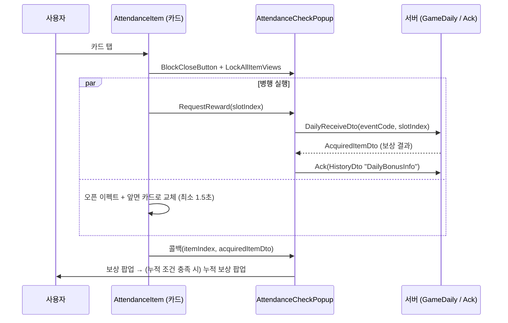

일일 출석(Attendance) 이벤트 — 네트워크 지연을 연출 뒤에 숨기는 카드 뒤집기 UI
=================================================================
> 하루에 한 번, 9장의 카드 중 하나를 골라 뒤집으면 보상이 나오는 출석 이벤트다. 몇 번 출석했는지에 따라 **누적 보상**도 함께 지급된다.
> 재접속률을 높이기 위한 이벤트 시스템(일일 출석, 미션, 패스) 중 하나다.
>
> 이 화면에서 볼 만한 지점은 세 가지다. ① **어떤 보상이 나올지는 서버가 정한다(클라이언트는 몇 번째 카드인지만 보낸다).** ② 서버 응답을 기다리는 시간을 **카드 뒤집기 연출 뒤에 숨긴다.**
> ③ 자정이 지나 날짜가 바뀌면 열려있던 팝업이 스스로 **새로고침을 유도**한다.

샘플 코드 (실제 프로젝트에서 그대로 가져옴)
> [`AttendanceCheckPopup.cs`](./AttendanceCheckPopup.cs) — 팝업 본체, 상태 관리, 요청/보상 연출, 날짜 변경 감시 · [`AttendanceItem.cs`](./AttendanceItem.cs) — 카드 한 장(뒤집기 연출 + 요청 병행) ·
> [`AccumulateRewardItemView.cs`](./AccumulateRewardItemView.cs) — 누적 출석 보상 한 칸 · [`AttendanceRewardDescriptionModal.cs`](./AttendanceRewardDescriptionModal.cs) — 누적 보상 내용 설명 모달

---

구조 한눈에 보기
------------------


1. 서버가 보상을 정하고, 클라이언트는 "몇 번째 카드"만 보낸다
------------------------------------------------------------
```csharp
//code값은 DailyInfo의 Code값을 전달한다!
DailyReceiveDto receiveDto = new DailyReceiveDto(this.eventCode, slotIndex);
...
GameDaily.Receive(requestDto, (responseDto) =>
{
    if (responseDto.code == (int)ResponseCode.OK)
    {
        HistoryDto dto = new HistoryDto("DailyBonusInfo", this.eventCode);
        networkManager.Ack(historyRequestDto, (ackResponse) => { cb?.Invoke(responseDto); });
        GameStorage.DailyDtoUpdatedTime = SBTime.Instance.ServerTime;
    }
    ...
});
```
* 요청에는 이벤트 코드와 슬롯 번호만 실린다. **보상 결정이 서버에 있으므로** 클라이언트가 뒤집을 카드를 골라도 결과를 바꿀 수 없다. 시트의 `Probability` 값을 읽어 `_weightDict` 를 만드는 코드가 남아있지만
  이 파일에서는 사용하지 않는다(과거 클라이언트 추첨 구현의 흔적으로 보이며, 아래 "한계"에 적었다).
* 성공 응답이 오면 `HistoryDto("DailyBonusInfo", 이벤트 코드)` 로 **Ack** 를 보낸다. IAP·패스와 같은 프로토콜이다([IAPProcess.md](../IAPProcess.md)).
  이 화면은 **Ack 응답이 돌아온 뒤에** 다음 연출 콜백(`cb`)을 호출한다. Ack 까지 끝난 뒤 보상 팝업을 보여주므로 "화면에는 받았다고 뜨는데 서버는 미확인" 인 구간이 짧아진다.
* 요청 직전에 `BroadcastTunnel` 로 로비 아이콘의 NewMark 를 끈다(`OffNewMark`). 로비 화면과 이 팝업은 서로를 직접 참조하지 않고 이벤트 이름으로만 연결된다
  ([100.Docs/02.설계패턴](../100.Docs/02.%EC%84%A4%EA%B3%84%ED%8C%A8%ED%84%B4/readme.md) 의 `BroadcastTunnel` 참고).

2. 네트워크 대기를 연출 뒤에 숨긴다 — `AttendanceItem.OnClick`
------------------------------------------------------------
```csharp
IEnumerator Tasks(Action<int, AcquiredItemDto> cb)
{
    bool isEffectFinished = true;
    bool protocolFinished = false;

    AcquiredItemDto acquiredItemDto = null;
    popup.RequestReward(this.itemIndex, this, responseDto =>          // 서버 요청은 즉시 시작하고
    {
        protocolFinished = true;
        acquiredItemDto = responseDto.data;
        this.UpdateRewardedIconWithAcquiredItems(responseDto.data);
    });

    this.openEffect.SetActive(true);                                    // 같은 프레임에 연출도 시작한다
    mainImage.sprite = Sprite.Create(this.frontCardImageTexture, ...);

    yield return new WaitForSeconds(1.5f);                              // 연출은 최소 1.5초 보장
    yield return new WaitUntil(() => protocolFinished && isEffectFinished);   // 응답이 더 늦으면 그때까지 대기

    popup.UnBlockCloseButton();
    cb?.Invoke(this.itemIndex, acquiredItemDto);
}
```
* 요청과 연출을 **순차가 아니라 병렬**로 시작한다. 응답이 빠르면 사용자는 로딩 없이 연출만 보고, 응답이 느리면 연출이 끝난 뒤에만 잠깐 기다린다.
  "뒤집는 동안 서버가 답을 가져온다"는 체감을 만드는 구조다.
* 연출이 도는 동안 **닫기 버튼을 막고**(`BlockCloseButton`) **다른 카드도 잠근다**(`LockAllItemViews`, `isRewardTask` 가드). 요청 중에 창이 닫히거나 다른 카드가 눌려서
  중복 요청이 나가는 것을 UI 단계에서 먼저 막는다. 진입 시 `Input.multiTouchEnabled = false` 로 두 손가락 동시 탭도 막고, `OnTriggerX` 에서 복원한다.
* `isEffectFinished` 는 항상 `true` 로 초기화되고 바뀌는 곳이 없다. 이펙트 종료를 기다리는 대신 고정 시간(`WaitForSeconds(1.5f)`)으로 연출 길이를 정하고 있다는 뜻이다.

3. 보상 팝업 두 단계 — 오늘의 보상 → 누적 보상
----------------------------------------------
카드 뒤집기 콜백(`OnClickReward`)은 서버가 내려준 `AcquiredItemDto` 를 받아 **1단계: 오늘의 보상 팝업**을 띄우고, 그 출석으로 누적 횟수가 기준(`dailyCumReward.DailyCumCount == dailyDto.count`)에
도달했다면 **2단계: 누적 보상 팝업**을 이어서 띄운다. 이후 누적 칸 UI 를 `SetStateOpen()` 으로 바꾸고 `ItemStorage.GetReward` 로 로컬 인벤토리를 갱신한 뒤 화면 문구를 다시 그린다(`SetLocales()`).
> 어느 슬롯이 어떤 보상 코드였는지는 `dailyRewards` 에서 (Bundle, Item, Value) 조합으로 찾고, 응답 DTO 는 **깊은 복사**해서 사용한다. 화면용으로 가공하는 값이 원본 응답에 섞이지 않게 하려는 처리로 보인다.

4. 날짜 변경 — 밤 12시가 지나도 팝업이 어긋나지 않게
--------------------------------------------------
```csharp
// RemainingTimeTask (매 프레임 돌아가는 코루틴)
now = this.timeFunc();                                       // 서버 시각 주입
if (GameStorage.DailyDtoUpdatedTime.Day < now.Day)           // 마지막 수령일보다 날짜가 지났다면
{
    var dailyDto = eventStorage.GetDailyEventData(this.eventCode).dailyDto;
    dailyDto.todayReceivedPos = 0;                           // 오늘 수령 기록 초기화
    dailyDto.todayReceivedReward = 0;
    this.OnDayChanged();                                     // 안내 팝업 → 닫고 다시 열기
    yield break;
}
```
* 서버 규칙은 "하루가 지나면 9칸이 모두 초기화된다"이다. 팝업을 켜 둔 채 자정을 넘기면 화면은 어제 상태 그대로이므로, **시계 코루틴이 날짜 변경을 감시**하다가 `OnDayChanged()` 에서
  `DayChanged` 이벤트 방송 → 안내 ConfirmPopup("밤 12시가 지나 화면이 새로고침 됩니다") → `result.args = true` 로 닫는다. `args = true` 는 "닫고 새로 열어 달라"는 신호로 쓰이며 패스 팝업의 `ReOpenPopup` 과 같은 방식이다(이 신호를 받는 호출부는 샘플에 포함하지 않았다).
* 시계 코루틴은 이벤트 종료 시각이 있는 경우(`RemainingTimeTask(signal, endTime)`)와 없는 경우(`RemainingTimeTask(signal)`)로 나뉘어 있고, 종료 시각에 도달하면 `OnEndTime()` 이 안내 팝업 후 팝업을 닫는다.
* 누적 보상이 반복(`RepeatBool`)형이면서 모두 수령된 상태에서 날짜가 바뀌면 `receivedCumRewards` 도 함께 초기화한다.

5. 누적 보상 칸 — `AccumulateRewardItemView`
-------------------------------------------
누적 칸을 누르면 그 보상이 일반 아이템인지 박스(`ItemType == 3`)인지에 따라 아이콘을 내려받아(`TextureController.GetTexture`) 설명 모달에 채운다. 박스라면 `GetBoxBundle()` 로 구성 아이템을 순회하며
하나씩 받는다. 텍스처 하나가 준비될 때마다 `WaitUntil(() => isFinished)` 로 다음 항목으로 넘어가서 **아이콘이 항상 순서대로 채워진다.** 코루틴은 `CoroutineTaskManager.AddTask` 로 등록하고
`OnDestroy` 에서 `RemoveTask` 로 회수해, 모달이 닫힌 뒤 콜백이 죽은 객체를 건드리지 않게 했다.

---

한계와 개선 방향
------------------
> 실서비스 코드라서 남아있는 부분을 그대로 적는다.
>
> * **날짜 변경 판정이 월 경계에서 깨진다.** `DailyDtoUpdatedTime.Day < now.Day` 는 "일(day) 숫자"만 비교하므로 31일 → 1일처럼 월이 바뀌는 순간에는 `31 < 1` 이 거짓이 되어 감지하지 못한다.
>   `DailyDtoUpdatedTime.Date < now.Date` 로 비교해야 하고, 서버가 기준으로 삼는 시간대(KST 자정)에 맞춰 두 값을 같은 시간대로 변환해야 한다.
> * **요청 실패 경로가 연출과 결합되어 있다.** `AttendanceItem.OnClick` 은 요청을 보내면서 카드를 이미 뒤집는다. 응답이 실패하면 `responseDto.data` 가 비어있는데도
>   `UpdateRewardedIconWithAcquiredItems` 와 콜백으로 그대로 흘러간다. 성공/실패를 나눠서, 실패 시 카드를 원래대로 되돌리고 재시도를 안내하는 분기가 필요하다.
>   (공통 예외 처리는 [05.Network/03.ApiException](../05.Network/03.ApiException/readme.md) 가 재시도 팝업을 띄워주기는 한다.)
> * **미사용 코드가 남아있다.** `SetWeightDict`/`_weightDict`(클라이언트 추첨 시절의 흔적), 주석 처리된 날짜 변경 블록, 테스트용 `OpenDummyAccumReceivedPopup` 등은 정리 대상이다.
> * **시계 코루틴이 두 벌로 복제되어 있다.** 종료 시각 유무만 다르고 날짜 변경 검사가 같은 형태로 반복된다. 종료 시각을 nullable 로 받는 하나의 코루틴으로 합칠 수 있다.
> * **남은 시간 문구 조립과 로케일(ko/en) 분기가 다른 이벤트 화면과 중복된다.** [01.Pass](../01.Pass/readme.md) 의 "한계"와 같은 항목이며, 공용 포매터로 모으는 것이 맞다.
> * **고정 대기(`WaitForSeconds(1.5f)`) 기반 연출이다.** 이펙트 종료 콜백이 있으면 `isEffectFinished` 플래그가 실제 의미를 갖게 된다.

관련 문서: [01.Pass](../01.Pass/readme.md) (같은 이벤트 계열, 같은 Ack 프로토콜) · [PopupUIPattern.md](../PopupUIPattern.md) · [IAPProcess.md](../IAPProcess.md)
