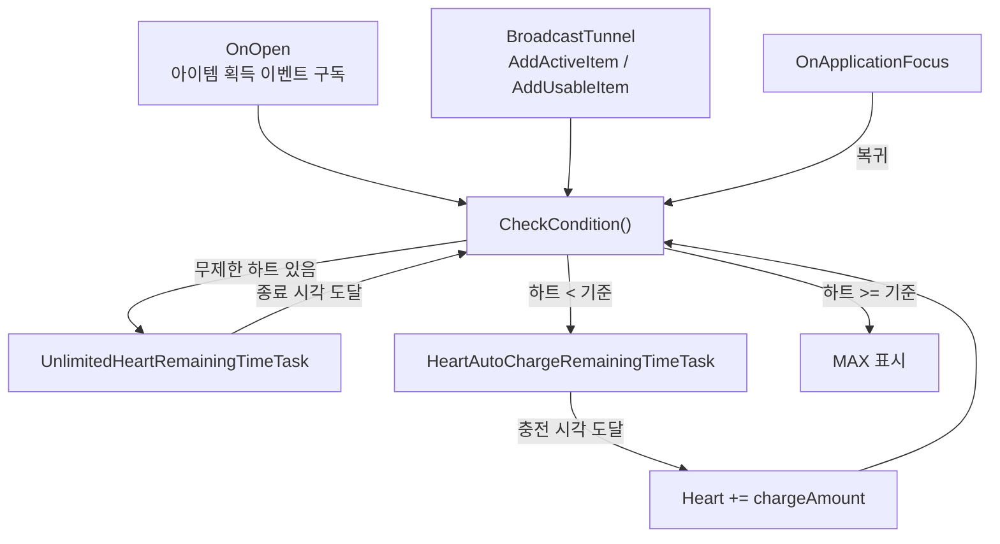

하트 자동 충전 표시 — 서버가 준 기준 시각에서 "다음 충전"을 계산하는 타이머
=========================================================================
> 로비 상단의 하트(플레이 횟수 재화) 영역이다. 하트는 **시간이 지나면 일정량씩 충전**되고, 무제한 하트 아이템이 발동 중이면 무제한 아이콘과 남은 시간이 보인다.
> 이 컴포넌트는 서버가 내려준 값을 **화면에서 어떻게 보여주고, 앱이 백그라운드에 다녀온 사이 어긋난 값을 어떻게 맞추는가**를 다룬다.
>
> 핵심은 세 가지다. ① 기기 시계가 아니라 **서버 시각 + 서버가 준 충전 기준 시각(`chargeReferenceTime`)** 으로 다음 충전 시점을 계산한다.
> ② 앱이 백그라운드에 다녀오면 **얼마나 있었는지에 따라 로컬에서 보정하거나, 너무 오래됐으면 재시작으로 서버 상태를 다시 받는다.**
> ③ 충전량·주기·최대치는 **코드에 박지 않고 데이터 시트에서** 읽는다.

샘플 코드 (실제 프로젝트에서 그대로 가져옴)
> [`HeartAutoCharger.cs`](./HeartAutoCharger.cs) — 표시 규칙, 충전 타이머 코루틴, 백그라운드 복귀 보정

---

표시 규칙 (파일 상단 주석을 그대로 옮김)
------------------------------------------
| 상황 | 화면 |
|------|------|
| 일반 상태 | 하트 개수 + (기준 미만일 때) 다음 충전까지 남은 `분:초` |
| 하트가 최대치(`chargeStandard`) 이상 | 타이머 자리에 `MAX` |
| 하트가 99개 초과 | 개수 자리에 `99+` |
| 무제한 하트 발동 중 | 무제한 아이콘 + 무제한 종료까지 남은 시간 |
| 무제한 하트를 추가로 얻음 | 남은 시간을 늘려서 표시 (이벤트 수신 후 재계산) |

구조 한눈에 보기
------------------

`CheckCondition()` 이 **"지금 어떤 상태인가"를 매번 처음부터 판정**하고 알맞은 타이머 하나만 시작하는 단일 진입점이다. 아이템 획득 이벤트, 백그라운드 복귀, 타이머 만료가
모두 이 함수로 합류하므로 상태 전이 규칙이 한 곳에 있다.

1. 다음 충전 시각 — 저장하지 않고 계산한다
-----------------------------------------
```csharp
IEnumerator HeartAutoChargeRemainingTimeTask(CancellableSignal signal, DateTime serverBeginTime)
{
    DateTime endTime = AddInterval(serverBeginTime);      // 다음 충전 예정 시각
    ...
    now = SBTime.Instance.ServerTime;                      // 서버 시각
    if (now <= endTime) UpdateRemainingTimeText(endTime - now);
    else { playerStorage.Heart += this.chargeAmount; this.CheckCondition(); }
    ...
    DateTime AddInterval(DateTime serverBeginTime)
    {
        var endTime = serverBeginTime.AddSeconds(this.chargeTime);
        while (endTime < SBTime.Instance.ServerTime)        // 기준 시각으로부터 충전 주기를 반복해서 더해
            endTime = endTime.AddSeconds(this.chargeTime);  // 아직 지나지 않은 첫 충전 시각을 찾는다
        return endTime;
    }
}
```
* 서버가 내려주는 값은 "충전을 시작한 기준 시각"(`HeartDto.chargeReferenceTime`) 하나다. 클라이언트는 그 시각에서 **충전 주기(`chargeTime`)를 반복해 더하며** 아직 오지 않은 가장 가까운 충전 시각을 구한다.
  앱을 오래 꺼 두었다 켜도, 기준 시각을 다시 쓰지 않고 **계산만으로** 다음 충전 시점을 얻는다(코드에서 기준 시각을 갱신하는 줄은 주석 처리되어 있다).
* 타이머 만료 시에는 하트를 `chargeAmount` 만큼 올리고 `CheckCondition()` 을 다시 호출한다. 다시 호출된 함수가 새 상태(아직 기준 미만인지, 최대치에 도달했는지)를 판정해 타이머를 이어가거나 `MAX` 로 멈춘다.
* 시각 비교는 모두 `SBTime.Instance.ServerTime` 이다. 기기 시계를 바꿔도 남은 시간이 흔들리지 않는다.
* 충전 코루틴은 `CancellableSignal(() => this == null)`, `activeInHierarchy`, `hasFocus` 검사로 종료 조건을 갖는다. 화면이 꺼지거나 앱이 백그라운드로 가면 스스로 멈추고, 복귀 시 `CheckCondition()` 이 새로 시작한다.

2. 충전 파라미터는 데이터 시트에서
--------------------------------
```csharp
int timeChargeInfoCode = SBDataSheet.Instance.UsableItemInfo[heartItemProductionCode].TimeChargeInfo;
this.chargeTime     = SBDataSheet.Instance.TimeChargeItemInfo[timeChargeInfoCode].ChargeTime;      // 몇 초마다
this.chargeAmount   = SBDataSheet.Instance.TimeChargeItemInfo[timeChargeInfoCode].ChargeValue;     // 몇 개씩
this.chargeStandard = (GameStorage.PlayerStorage.IsSubscription)                                   // 최대치 (구독자는 보너스)
    ? SBDataSheet.Instance.SubscribeBuff[1].GetBuffByBuff().Value + ....ChargeMaxValue
    : ....ChargeMaxValue;
```
> 충전 주기·개수·최대치, 구독 버프까지 시트에서 읽으므로 **밸런스 조정이나 이벤트성 충전 변경에 클라이언트 빌드가 필요 없다.** `CheckCondition()` 이 호출될 때마다 다시 읽기 때문에
> 구독 상태가 바뀌어도 바로 반영된다.

3. 무제한 하트 판정
--------------------
```csharp
var unlimitedHeartItems = playerStorage.ActiveItems.ToList().FindAll(x =>
    (x.code == 1) && (SBTime.Instance.dtoTimeToServerTime(x.endedAt) >= SBTime.Instance.ServerTime));
```
활성 아이템 목록에서 하트 무제한 아이템(`code == 1`)이면서 **종료 시각이 아직 지나지 않은 것**이 있으면 일반 충전 타이머 대신 무제한 타이머를 시작한다. 종료 시각에 도달하면 타이머가 스스로 멈추고
`CheckCondition()` 을 다시 호출해 일반 충전 상태로 돌아간다. 아이템 획득은 `BroadcastTunnel<string,int>` 의 `AddActiveItem` / `AddUsableItem` 이벤트로 전달받는다.

4. 백그라운드 복귀 보정
------------------------
모바일 게임은 전화, 홈 버튼, 앱 전환으로 자주 백그라운드에 다녀온다. 그 사이 타이머는 갱신되지 않으므로, `OnApplicationFocus` 에서 **나갈 때 상태를 기록하고 돌아올 때 비교**한다(아래는 일부 줄을 줄여서 발췌).
```csharp
void OnFocusOut()
{
    this.focusOutTime = SBTime.Instance.ServerTime;                                  // 나간 시각
    ...
    this.focusOutChargeRefTime      = dtoChargeRefTime;                              // 충전 기준 시각
    this.focusOutNextHeartChargeTime = AddInterval(this.focusOutChargeRefTime.Value); // 나갈 때 기준 다음 충전 예정
}

void OnFocus()
{
    int restartConfigValue = 1200;                                                    // 기본 20분
    if (SBDataSheet.Instance.GameConfig[13] != null)
        restartConfigValue = SBDataSheet.Instance.GameConfig[13].integerValue;        // 시트 설정으로 덮어씀

    TimeSpan returnTimeSpan = now - this.focusOutTime.Value;
    if (returnTimeSpan.TotalMinutes * 60 >= restartConfigValue)
    {
        GameScene.Instance.OnRestart();                                              // 너무 오래 나갔다 옴: 재시작으로 서버 상태 재동기화
        return;
    }
    ...
    // 나갔던 동안 지나간 충전 횟수만큼 로컬에서 보정
    int res1 = (int)(now.Subtract(focusOutNextHeartChargeTime).TotalSeconds / this.chargeTime) + 1;
    playerStorage.Heart += res1 * this.chargeAmount;
    if (playerStorage.Heart > this.chargeStandard) playerStorage.Heart = this.chargeStandard;
}
```
* 나가 있던 시간이 **설정값(시트 `GameConfig[13]`, 기본 1200초) 이상**이면 로컬 보정을 하지 않고 씬을 재시작(`OnRestart`)해 서버 상태를 다시 받는다. 짧은 이탈에서 다시 로딩을 태우면 불편하고, 긴 이탈에서는
  로컬 계산이 서버와 어긋날 위험이 커진다는 절충이다. 기준 시간을 코드 상수가 아니라 시트 값으로 두어 운영 중 조정할 수 있다.
* 그보다 짧다면 나갈 때 기록해 둔 "다음 충전 예정 시각"과 현재 시각의 차이로 **그 사이 지나간 충전 횟수**를 구해 하트를 올리고, 최대치를 넘지 않게 자른 뒤 `CheckCondition()` 으로 타이머를 다시 시작한다.
  무제한 하트 발동 중이거나 하트가 가득 차 있으면 보정하지 않는다.
* 이 파일 안에는 충전을 서버에 요청하는 호출이 없다. 클라이언트가 계산한 하트 수는 **표시용 예측값**이고, 실제 값은 서버 기준이라는 전제로 보인다. 오래 나갔다 오면 재시작으로 서버 값을 다시 받는 것도 그 때문으로 읽힌다.

---

한계와 개선 방향
------------------
> 실서비스 코드라서 남아있는 부분을 그대로 적는다.
>
> * **`OnApplicationFocus` 안의 로직이 길고 중첩 로컬 함수가 많다.** 상태 기록(`focusOutTime` 외 3개 필드), 복귀 보정, 재시작 판정이 한 메서드에 있다. 복귀 보정을 `HeartOfflineChargeCalculator.Calculate(refTime, now, chargeTime, amount, max)` 같은
>   순수 함수로 빼면 단위 테스트가 가능하다. 지금은 "몇 분 나갔다 오면 몇 개가 차야 하는가"를 실기기에서 직접 재현해야 검증된다.
> * **`AddInterval` 이 같은 형태로 두 번 정의되어 있다.** (`OnFocusOut` 안, 충전 코루틴 안). 클래스 메서드 하나로 합쳐야 한다.
> * **타이머 만료 경로에는 최대치 상한 처리가 보이지 않는다.** `Heart += chargeAmount` 후 `CheckCondition()` 이 `Heart >= chargeStandard` 를 `MAX` 로 표시하는 방식이라, `PlayerStorage.Heart` 세터가 상한을 자르지 않는다면 `chargeAmount > 1` 일 때 표시 값이
>   최대치를 잠깐 넘을 수 있다(세터 구현은 샘플에 없어 확인하지 못했다). 복귀 보정 경로처럼 `Min(Heart, chargeStandard)` 로 자르는 것이 일관적이다.
> * **시각 타입이 섞여 있다.** `ServerTime`, `UTCServerTime`, `dtoTimeToServerTime`, `localTimeToUTC` 가 한 파일에서 함께 쓰인다. 값이 같은 시간대인지 읽는 사람이 매번 확인해야 하므로,
>   서버 시각을 하나의 타입/유틸로 감싸는 편이 안전하다.
> * **`OnConsumeItemEvent` 가 예외를 삼킨다.** `try { CheckCondition(); } catch (Exception) { }` 는 실패 원인을 숨긴다. 최소한 로그를 남겨야 한다.
> * **로컬 푸시(하트 충전 완료 알림)는 구현만 남고 호출은 주석 처리되어 있다.** `ScheduleHeartFullNotification` 호출부와 `SetHeartPushAfterQuit` 안의 알림 예약은 주석 처리되어 있으므로, 기능을 되살리거나 삭제해야 한다.
> * **디버그 로그 정리가 필요하다.** `"SJW #0x"` 처럼 작성자 이니셜과 번호가 붙은 임시 로그가 여러 곳에 있다. 로그 카테고리를 만들어 릴리스 빌드에서 제거되도록 해야 한다.
> * **`beforeFocusOutRemainUnlimitedHeartTimeSpan` 은 기록만 하고 읽는 곳이 없다.** 무제한 하트의 백그라운드 이탈은 현재 `CheckCondition()` 이 종료 시각을 다시 계산해 처리하므로 필드 자체가 필요 없다.

관련 문서: [01.Pass](../01.Pass/readme.md) · [02.Attendance](../02.Attendance/readme.md) (같은 서버 시각 기준 방식) · [100.Docs/02.설계패턴](../100.Docs/02.%EC%84%A4%EA%B3%84%ED%8C%A8%ED%84%B4/readme.md) (`BroadcastTunnel`)
