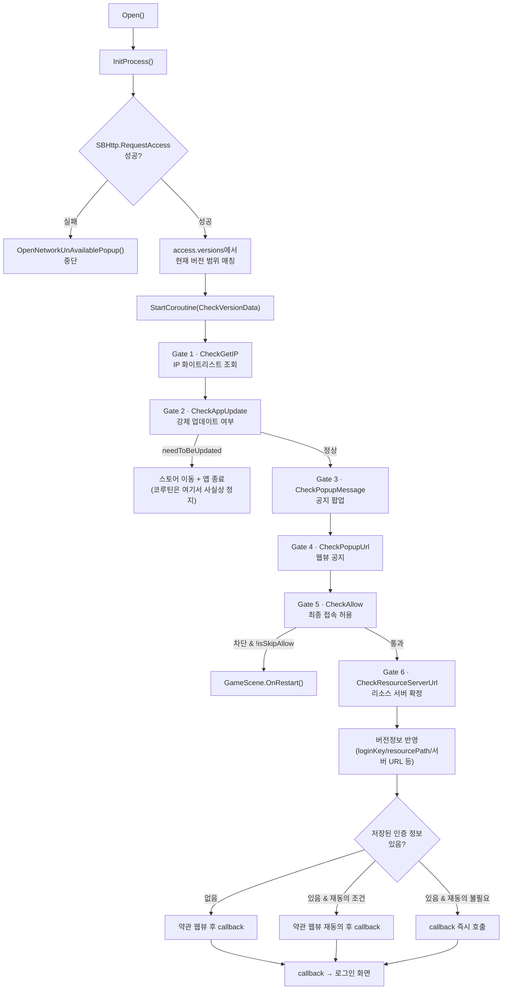

# NetworkManager 부팅 게이트 시퀀스 분석

> StarWay-Client(Unity 3-Match 퍼즐)가 실행 직후 로그인 화면에 도달하기까지 통과하는 서버 제어형 부팅
> 파이프라인을 코드 레벨로 분석한 문서입니다. 대상 파일은 `Assets/Scripts/Server/Network/NetworkManager.cs`
> (총 1,822줄) 이며, 이 문서는 그중 부팅 시퀀스를 구성하는 `Open → InitProcess → CheckVersionData →
> (CheckGetIP → CheckAppUpdate → CheckPopupMessage → CheckPopupUrl → CheckAllow →
> CheckResourceServerUrl) → 약관 동의` 체인만 발췌했습니다.

**대상 파일**: `Assets/Scripts/Server/Network/NetworkManager.cs`
**진입점**: `NetworkManager.Open(Action initProcessCallback)`
**구현 방식**: `IEnumerator` 코루틴 체인 + `async/await`(로그인 이후 흐름) 혼합, `#if UNITY_EDITOR` /
`#if UNITY_ANDROID || UNITY_IOS` 플랫폼 분기

앱을 실행한 유저가 로그인 화면을 보기까지, 서버는 "이 버전으로 접속을 허용할지", "강제 업데이트가
필요한지", "지금 공지할 내용이 있는지", "약관에 다시 동의를 받아야 하는지"를 차례로 판단해야 합니다.
이 판단들을 클라이언트가 한 번에 병렬로 물어보면, 예를 들어 강제 업데이트 대상인 유저에게 공지 팝업이나
약관 동의 화면이 먼저 떠버리는 순서 역전이 발생할 수 있습니다. `CheckVersionData()`가 6개 게이트를
`IEnumerator`로 하나씩 직렬 연결해 둔 것은 이 순서 보장이 핵심 목적이며, 뒤로 갈수록 "더 무거운 확인"이
오도록(IP 조회 → 강제 업데이트 → 공지 → 웹뷰 공지 → 최종 허용 → 리소스 서버) 배치되어 있어 앞 단계에서
차단될 유저가 뒤 단계의 네트워크 호출·팝업 렌더링 비용을 치르지 않도록 짜여 있습니다. 이 체인을 모두
통과한 뒤 `callback`이 호출되면 로그인 화면에서 SSO 웹뷰 로그인(`ShowLoginWebView` / `SBHttp.RequestSSO`)
흐름이 이어지는데, 이 문서는 그 앞단인 게이트 체인 자체에 집중합니다.

---

## 목차

1. [전체 그림](#1-전체-그림)
2. [진입점 — `Open()` → `InitProcess()`](#2-진입점--open--initprocess)
3. [오케스트레이터 — `CheckVersionData()`](#3-오케스트레이터--checkversiondata)
4. [게이트 1 — `CheckGetIP()` : IP 화이트리스트](#4-게이트-1--checkgetip--ip-화이트리스트)
5. [게이트 2 — `CheckAppUpdate()` : 강제 업데이트](#5-게이트-2--checkappupdate--강제-업데이트)
6. [게이트 3 — `CheckPopupMessage()` : 공지 팝업](#6-게이트-3--checkpopupmessage--공지-팝업)
7. [게이트 4 — `CheckPopupUrl()` : 웹뷰 공지 / 서비스 차단](#7-게이트-4--checkpopupurl--웹뷰-공지--서비스-차단)
8. [게이트 5 — `CheckAllow()` : 최종 접속 허용 판단](#8-게이트-5--checkallow--최종-접속-허용-판단)
9. [게이트 6 — `CheckResourceServerUrl()`](#9-게이트-6--checkresourceserverurl)
10. [마무리 — 버전정보 반영 & 약관 재동의](#10-마무리--버전정보-반영--약관-재동의)

---

## 1. 전체 그림



`isSkipAllow`는 **Gate 1**에서 한 번 계산되어 **Gate 3, 4, 5** 세 곳에서 재사용되는 공유 상태입니다. 이 문서
전체에서 반복해서 등장하니 먼저 짚고 넘어갑니다.

| 단계 | 함수 | 실패/차단 시 동작 | `isSkipAllow` 관여 |
|---|---|---|---|
| 0 | `InitProcess()` | 네트워크 불가 팝업 후 중단 | — |
| 1 | `CheckGetIP()` | (실패해도 안전하게 통과) | **생성** |
| 2 | `CheckAppUpdate()` | 스토어 이동 + 앱 종료 | 미사용 |
| 3 | `CheckPopupMessage()` | `allow=false`면 재시작 | 사용(우회) |
| 4 | `CheckPopupUrl()` | `allow=false`면 종료 | 사용(우회) |
| 5 | `CheckAllow()` | 차단 팝업 + 재시작 | 사용(우회) |
| 6 | `CheckResourceServerUrl()` | (항상 통과) | — |
| 7 | 약관 동의 (`CheckVersionData` 하단) | 웹뷰 재동의 요구 | — |

**설계 포인트 — 왜 병렬이 아니라 직렬인가**

6개 게이트 각각은 서로 다른 서버 응답(IP 화이트리스트, 버전별 정책, 공지 문구, 웹뷰 URL)에 의존하지만,
모두 `access`/`version` 하나로부터 파생된 값이라 이론적으로는 동시에 판단할 수도 있습니다. 그럼에도
`yield return`으로 하나씩 순서를 강제한 이유는 두 가지입니다. 첫째, 강제 업데이트 대상 유저가 공지
팝업이나 약관 동의 화면을 먼저 마주치는 순서 역전을 막기 위함이고, 둘째, `isSkipAllow`처럼 뒤 게이트가
앞 게이트의 계산 결과를 그대로 참조하는 의존 관계가 있기 때문입니다. 병렬로 실행했다면 이 의존 관계를
게이트마다 다시 동기화해야 했을 것을, 직렬 코루틴 체인이라는 가장 단순한 도구로 해결한 것입니다.

---

## 2. 진입점 — `Open()` → `InitProcess()`

```csharp
public void Open(Action initProcessCallback = null)
{
    this.isStarted = true;
    configs.init(AccessInfoURL);
    StartRefreshTokenCoroutine();
    InitProcess(initProcessCallback);
}
```

```csharp
public void InitProcess(Action callback = null)
{
    SBHttp.RequestAccess((access) =>
    {
        // accessUrl 에 통신 실패.
        if (access == null)
        {
            ViewController.OpenNetworkUnAvailablePopup();
        }
        else
        {
            VersionDto version = null;
            string curVersion = Application.version;
            foreach (VersionDto item in access.versions)
            {
                // 접속 정보에서 현재 버전에 해당 되는 정보를 찾음
                int minDiff = item.min == null ? 1 : SBString.versionDiff(curVersion, item.min);
                int maxDiff = item.max == null ? 1 : SBString.versionDiff(item.max, curVersion);
                if (minDiff + maxDiff > 0)
                {
                    version = item;
                    break;
                }
            }

            accessData = access;

            StartCoroutine(CheckVersionData(access, version, callback));
        }
    });
}
```

**동작 설명**

- `Open()`은 `NetworkManager`의 단일 진입점입니다. `isStarted` 플래그를 세우고, 자동 로그인용
  `AccessInfoURL`을 `SBConfigs`에 주입한 뒤, **토큰 자동 갱신 코루틴**(`StartRefreshTokenCoroutine`, 60초
  주기)을 먼저 띄우고 나서야 `InitProcess`로 넘어갑니다. 즉 부팅 게이트 체인이 아직 끝나지 않았어도 토큰
  갱신 루프는 이미 백그라운드에서 돌기 시작합니다. 이 순서를 뒤집어 게이트 체인이 끝난 뒤에 갱신
  코루틴을 띄웠다면, 게이트 통과에 오래 걸리거나 유저가 공지 팝업을 붙들고 있는 동안 로그인 이후 발급된
  토큰의 첫 갱신 시점이 그만큼 늦어질 수 있습니다 — 부팅 절차와 무관하게 최대한 일찍 갱신 루프를 확보해
  두는 편이 안전하다는 판단으로 읽힙니다.
- `InitProcess`는 `SBHttp.RequestAccess`로 서버에서 **접속 정보 전체**(`AccessDto`, 여러 버전대의 정책이
  배열로 들어있음)를 한 번에 받아옵니다. 통신 자체가 실패하면(`access == null`) 이후 게이트를 아예 태우지
  않고 `OpenNetworkUnAvailablePopup()`으로 조기 종료합니다.
- 흥미로운 부분은 **버전 범위 매칭 루프**입니다. `access.versions` 배열의 각 항목은 `min`/`max` 버전
  문자열을 가지고 있고, `SBString.versionDiff(a, b)`로 두 버전 문자열의 대소를 비교합니다.
  `minDiff + maxDiff > 0`이라는 조건은 "현재 버전이 `min` 이상이면서 `max` 이하"인 구간을 찾는
  트릭입니다 — `min`이 없으면 무조건 통과(`1`), `max`가 없으면 무조건 통과(`1`)로 처리해 하한/상한이
  없는 버전 정책도 표현할 수 있게 했습니다. 여러 버전대(예: 1.0.x, 1.1.x, 1.2.x)마다 **강제 업데이트
  여부, 접속 서버, 공지 문구를 서버 배열 하나로 동시에 관리**할 수 있는 구조입니다.
- 매칭된 `version`이 `null`일 수도 있는데(현재 버전이 어떤 구간에도 속하지 않는 경우), 이 경우의 처리는
  다음 단계인 `CheckVersionData`의 첫 줄에서 이루어집니다.

---

## 3. 메인 절차 — `CheckVersionData()`

```csharp
public IEnumerator CheckVersionData(AccessDto access, VersionDto version, Action callback)
{
    if (version == null)
    {
        // 버전 값에 맞는 정보가 없을 경우
        Debug.Log("No access information was found for the current version.");
        yield break;
    }

    // 아이피 체크.
    yield return this.CheckGetIP(access);

    // 앱 강제업데이트 체크.
    yield return this.CheckAppUpdate(version);

    // 팝업메시지 체크.
    yield return this.CheckPopupMessage(version);

    // 팝업웹뷰 체크.
    yield return this.CheckPopupUrl(version);

    yield return this.CheckAllow(version);

    yield return this.CheckResourceServerUrl(version);

    // ... 버전정보 반영 + 약관 동의 처리 (10절에서 별도로 다룸)
}
```

**동작 설명**

- 이 함수는 실제 판단 로직을 전혀 갖고 있지 않은 **오케스트레이터**입니다. 6개의 하위 코루틴을
  `yield return`으로 순차 연결만 합니다. Unity 코루틴에서 `yield return 다른IEnumerator`는 "그
  코루틴이 완전히 끝날 때까지 여기서 대기"를 의미하므로, 이 6줄만으로 **엄격한 순서 보장**이 이루어집니다
  — IP 체크가 끝나기 전에는 강제 업데이트 팝업이 뜨지 않고, 강제 업데이트를 통과하기 전에는 공지 팝업이
  뜨지 않습니다.
- `version == null`이면 `yield break`로 **코루틴 자체를 즉시 종료**합니다. 이 경우 `callback`이 영원히
  호출되지 않는다는 점에 주의해야 합니다 — 로그로만 남기고 사실상 게임이 로그인 화면으로 진행하지 못하고
  멈춥니다(서버 접속 정보 배열에 현재 버전을 커버하는 구간이 없는, 설정 실수 상황에 대한 방어).
- 각 하위 게이트 앞에 붙은 한국어 주석(`// 아이피 체크.`, `// 앱 강제업데이트 체크.` 등)이 곧 이
  함수의 "목차" 역할을 합니다 — 코드 자체가 자기 문서화된 형태입니다.

---

## 4. 게이트 1 — `CheckGetIP()` : IP 화이트리스트

```csharp
private IEnumerator CheckGetIP(AccessDto access)
{
    bool isFinished = false;

    if (access.ipCheckUrl != null)
    {
        try
        {
            string externalIP = new WebClient().DownloadString(access.ipCheckUrl);

            isSkipAllow = Array.Exists(access.allowIPs, x => x.Equals(externalIP));

            isFinished = true;
        }
        catch (Exception e)
        {
            isSkipAllow = false;
            isFinished = true;
        }
    }
    else
    {
        isFinished = true;
    }

    yield return new WaitUntil(() => isFinished);
}
```

**상황 (문제 인식)**

사내/QA 환경은 이후 게이트(공지·강제 업데이트성 차단)를 매번 통과하지 않고 우회해서 테스트할 수 있어야
합니다. 이 우회 판단은 **외부 IP 조회 결과**로 이루어지는데, `access.ipCheckUrl`을 호출하는 이 조회
자체가 네트워크 장애나 응답 지연으로 실패할 가능성이 있고, 그렇다고 이 실패가 전체 부팅 시퀀스를 멈춰서는
안 됩니다.

**해결 과정**

- `WebClient().DownloadString(access.ipCheckUrl)`로 외부 IP 조회 API를 **동기 호출**합니다(코루틴
  안이지만 이 한 줄 자체는 블로킹 호출입니다 — 응답이 올 때까지 해당 프레임 실행이 멈춥니다).
- 응답으로 받은 IP가 `access.allowIPs`(서버가 내려준 화이트리스트 배열) 안에 있는지
  `Array.Exists`로 확인해 `isSkipAllow`에 대입합니다.
- 이 호출 전체를 `try/catch`로 감싸, 예외가 나도 `isSkipAllow = false`(우회 아님, 즉 "안전하게 일반
  유저처럼 취급")로 폴백하고 `isFinished = true`로 코루틴을 마무리시킵니다. **성공 경로와 실패 경로
  모두 반드시 `isFinished = true`로 귀결**되도록 짜여 있어, 이 함수가 무한정 대기하는 경우가 없습니다.
- `access.ipCheckUrl`이 아예 없으면(서버가 이 기능을 안 쓰는 정책) 조회 자체를 생략하고 바로
  `isFinished = true`.
- `yield return new WaitUntil(() => isFinished)`는 이 파일 전체에서 반복되는 **코루틴 ↔ 콜백 동기화
  패턴**입니다(11절 참고). 비동기 콜백이 `isFinished`를 세팅할 때까지 매 프레임 조건을 검사하며 대기합니다.

**결과**

이후 3~5번 게이트(공지 팝업, 웹뷰 공지, 최종 허용 판단)에서 공통으로 참조하는 `isSkipAllow` 플래그를
한 곳에서 확보했고, 조회 API 장애가 전체 부팅을 막는 단일 장애점(SPOF)이 되지 않도록 격리했습니다.

---

## 5. 게이트 2 — `CheckAppUpdate()` : 강제 업데이트

```csharp
private IEnumerator CheckAppUpdate(VersionDto version)
{
    bool isFinished = false;

    if (version.needToBeUpdated == true)
    {
        ViewController.OpenApplicationUpdatePopup((isOk) =>
        {
            string url = CommonProcessController.GetStoreURL();
            Application.OpenURL(url);

#if UNITY_EDITOR
            UnityEditor.EditorApplication.isPlaying = false;
#else
            Application.Quit();
#endif
        });

        yield return null;
    }
    else
    {
        isFinished = true;
    }

    yield return new WaitUntil(() => isFinished);
}
```

**상황**

치명적 버그나 정책 변경 시 서버 값 하나로 구버전 클라이언트의 실행 자체를 막아야 합니다. 그런데
에디터에서 개발/QA할 때마다 스토어로 튕기거나 플레이가 강제 종료되면 개발 루프가 크게 방해받습니다.

**해결 과정**

- `version.needToBeUpdated`가 `true`인 경우에만 분기합니다. 팝업 확인 콜백 안에서
  `CommonProcessController.GetStoreURL()`로 스토어 URL을 얻어 `Application.OpenURL`로 스토어를 띄운
  뒤, `#if UNITY_EDITOR`로 에디터에서는 `EditorApplication.isPlaying = false`(플레이 모드 중지),
  실기기 빌드에서는 `Application.Quit()`으로 갈라 처리합니다.
- **눈여겨볼 지점**: `needToBeUpdated` 분기에서는 `isFinished`를 **어디에서도 `true`로 세팅하지
  않습니다.** `yield return null`로 한 프레임만 양보하고 그 다음 줄인
  `yield return new WaitUntil(() => isFinished)`로 넘어가는데, 이 조건은 영원히 거짓입니다. 즉 이
  분기를 타면 **코루틴은 사실상 다시는 재개되지 않습니다.** 이건 버그가 아니라, "팝업 확인과 동시에
  앱이 종료되거나 플레이가 멈추므로 그 뒤 코드가 실행될 일이 없다"는 전제를 깔고 짠 의도적인 설계로
  읽힙니다 — 다만 `Application.Quit()`이 즉시 프로세스를 죽이지 않는 일부 플랫폼(예: 특정 콘솔/웹
  환경)에서는 이 가정이 깨질 수 있어, 이식성 관점에서는 잠재적 위험 지점이기도 합니다.
- `needToBeUpdated`가 `false`면 `isFinished = true`로 즉시 통과.

**결과**

배포 파이프라인을 거치지 않고 서버 값 변경만으로 특정 버전대의 실행을 즉시 차단할 수 있고, 로컬 개발
워크플로우는 이 게이트에 전혀 영향받지 않습니다.

---

## 6. 게이트 3 — `CheckPopupMessage()` : 공지 팝업

```csharp
private IEnumerator CheckPopupMessage(VersionDto version)
{
    bool isFinished = false;

    if (version.popupMessage != null && version.popupMessage.Length > 0)
    {
        // 팝업 메시지 로케일 구분 했습니다.
        string lang = ((GameStorage.UserAccountLanguage == Snowballs.Client.Type.Language.ko) ? "ko" : "en");
        string message = "";
        foreach (var popupMessage in version.popupMessage)
        {
            // 디폴트 영문 세팅
            if (String.IsNullOrEmpty(message) && popupMessage.region == "en")
            {
                message = popupMessage.text;
            }
            // 설정된 언어 값에 해당하는 메시지가 있다면 세팅
            if (popupMessage.region == lang)
            {
                message = popupMessage.text;
            }
        }
        ViewController.OpenConfirmPopup(LocaleController.GetBuiltInLocale(6), message, (isOk) =>
        {
            if (version.allow)
            {
                isFinished = true;
            }
            else
            {
                if (isSkipAllow)
                {
                    isFinished = true;
                }
                else
                {
                    GameScene.Instance.OnRestart();
                }
            }
        });
    }
    else
    {
        isFinished = true;
    }

    yield return new WaitUntil(() => isFinished);
}
```

**상황**

공지 문구는 여러 언어로 서버에서 내려오고, 같은 팝업의 "확인" 버튼 하나가 **두 가지 서로 다른 의미**를
가져야 합니다 — 그냥 안내성 공지라면 확인 즉시 진행, 하지만 `version.allow`가 꺼져 있는 상황(서비스
점검/차단)이라면 같은 확인 버튼이 사실상 "차단 안내를 읽었으니 재시작"의 트리거가 되어야 합니다.

**해결 과정**

- 로케일 매칭: `version.popupMessage`는 `{region, text}` 배열입니다. 루프를 돌면서 **①`region == "en"`인
  항목을 먼저 기본값으로 채우고, ②사용자 로케일(`GameStorage.UserAccountLanguage`)과 일치하는 항목을
  만나면 덮어쓰는** 2단계 방식으로 "해당 언어 없으면 영문 폴백" 동작을 배열 순회 한 번으로 구현했습니다.
- 팝업 확인 콜백에서의 3중 분기가 핵심입니다:
  1. `version.allow == true` → 정상 공지였으므로 `isFinished = true`로 그냥 통과.
  2. `version.allow == false` 이면서 `isSkipAllow == true`(화이트리스트 IP) → 차단 대상이지만
     예외 대상이므로 통과.
  3. 그 외(`allow == false` && `!isSkipAllow`) → `GameScene.Instance.OnRestart()`로 게임을
     재시작시켜 사실상 접속을 막습니다.
- `version.popupMessage`가 없거나 빈 배열이면 팝업 자체를 띄우지 않고 즉시 통과.

**결과**

"공지 노출"과 "서비스 차단"이라는 서로 다른 두 운영 액션을 하나의 팝업 컴포넌트로 처리하면서도, 서버가
내려주는 `allow` / `popupMessage` 두 값의 조합만으로 운영자가 코드 수정 없이 두 시나리오를 자유롭게
전환할 수 있습니다.

---

## 7. 게이트 4 — `CheckPopupUrl()` : 웹뷰 공지 / 서비스 차단

```csharp
private IEnumerator CheckPopupUrl(VersionDto version)
{
    bool isFinished = false;

    if (version.popupUrl != null)
    {
#if UNITY_EDITOR
        ViewController.OpenConfirmPopup(LocaleController.GetBuiltInLocale(6), "에디터라서 팝업으로 대체", (isOk) =>
        {
            if (version.allow)
            {
                isFinished = true;
            }
            else
            {
                if (isSkipAllow)
                {
                    isFinished = true;
                }
                else
                {
                    UnityEditor.EditorApplication.isPlaying = false;
                }
            }
        });
#else
        string url = version.popupUrl + "?lang=" + ((GameStorage.UserAccountLanguage == Snowballs.Client.Type.Language.ko) ? "ko" : "en");
        ViewController.OpenWebView(url, () =>
        {
            if (version.allow)
            {
                isFinished = true;
            }
            else
            {
                if (isSkipAllow)
                {
                    isFinished = true;
                }
                else
                {
                    Application.Quit();
                }
            }
        });
#endif
    }
    else
    {
        isFinished = true;
    }

    yield return new WaitUntil(() => isFinished);
}
```

**상황**

3번 게이트(단순 텍스트 팝업)와 별개로, 이미지·링크가 포함된 풍부한 공지를 **웹뷰**로 보여줘야 하는
경우가 있습니다. 그런데 에디터에는 실제 인앱 웹뷰(`UniWebView` 등 네이티브 플러그인)를 띄울 수 없다는
플랫폼 제약이 있습니다.

**해결 과정**

- 3번 게이트와 **완전히 동일한 3중 allow/isSkipAllow 분기**를 재사용하되, 차단 시 최종 액션만
  `GameScene.Instance.OnRestart()`(재시작) 대신 `UnityEditor.EditorApplication.isPlaying = false`
  또는 `Application.Quit()`(완전 종료)으로 더 강하게 처리합니다 — 3번은 "다시 시작", 4번은 "종료"로
  차단 강도가 다르게 설계되어 있습니다.
- `#if UNITY_EDITOR ... #else ... #endif`로 에디터/실기기를 완전히 이분화했습니다. 에디터 분기는 실제
  웹뷰 대신 `ViewController.OpenConfirmPopup`을 재사용하면서, 팝업 메시지 자체를
  `"에디터라서 팝업으로 대체"`라는 개발자를 위한 문구로 남겨 두었습니다 — 실기기와 100% 동일한 코드
  경로(같은 allow/isSkipAllow 분기)를 타면서도 웹뷰 플러그인 의존성만 우회한 것입니다.
- 실기기 분기는 `version.popupUrl`에 언어 쿼리스트링(`?lang=ko`/`?lang=en`)을 붙여
  `ViewController.OpenWebView`를 호출합니다.

**결과**

"공지 노출"과 "서비스 차단"을 웹뷰 기반으로도 동일하게 지원하면서, 에디터에서는 네이티브 웹뷰 플러그인
없이도 **같은 분기 로직을 즉시 검증**할 수 있습니다. 이는 QA/개발 반복 속도에 직접적으로 기여하는
부분입니다.

---

## 8. 게이트 5 — `CheckAllow()` : 최종 접속 허용 판단

```csharp
private IEnumerator CheckAllow(VersionDto version)
{
    bool isFinished = false;
    if (!version.allow)
    {
        if (isSkipAllow)
        {
            isFinished = true;
        }
        else
        {
            // 서버에서 접속을 차단하고 있음
            Debug.Log("Server access is being blocked.");

            ViewController.OpenConfirmPopup(LocaleController.GetBuiltInLocale(6), LocaleController.GetBuiltInLocale(11), (isOk) =>
            {
                GameScene.Instance.OnRestart();
            });
        }
    }
    else
    {
        isFinished = true;
    }

    yield return new WaitUntil(() => isFinished);
}
```

**상황**

3, 4번 게이트는 `popupMessage`/`popupUrl`이 **있을 때만** allow를 검사합니다. 즉 서버가 공지 문구나
웹뷰 URL을 아예 내려주지 않으면 그 사이에서는 `allow=false`가 걸러지지 않고 통과해 버립니다. 공지 없이
접속만 차단하고 싶은 경우를 위한 **최종 안전장치**가 필요합니다.

**해결 과정**

- `!version.allow`(차단 상태)일 때만 동작합니다. `isSkipAllow`면 조용히 통과시키고, 아니면
  `LocaleController.GetBuiltInLocale(11)` — 코드에 내장된 로케일 문자열 11번(차단 안내 문구로 추정) —
  을 담은 확인 팝업을 띄운 뒤 확인 즉시 `GameScene.Instance.OnRestart()`로 재시작시킵니다.
- 3, 4번 게이트와 달리 **공지 문구 유무와 무관하게** 항상 검사되는, 조건 없는 최종 게이트라는 점이
  핵심 차이입니다.

**결과**

공지 팝업/웹뷰 설정 여부와 관계없이 `allow` 하나만으로 접속 차단을 강제할 수 있는 **최후의 방어선**을
확보했습니다. 3~5번 게이트가 사실상 "차단 판단을 내리는 3중 체크포인트"를 형성합니다.

---

## 9. 게이트 6 — `CheckResourceServerUrl()`

```csharp
private string _assetServerName;
public string AssetServerName => this._assetServerName;

private IEnumerator CheckResourceServerUrl(VersionDto versionDto)
{
    this._assetServerName = versionDto.asset;
    yield return null;
}
```

앞선 5개 게이트와 달리 판단 로직이 없는 단순 대입입니다. 서버가 내려준 리소스(에셋) 서버 이름을
`AssetServerName` 프로퍼티로 캐싱해, 이후 `TestAssetLoader()`(리소스 다운로드 로직, 최대 5회 재시도)가
어떤 서버에서 에셋을 받아올지 판단할 수 있게 합니다. `yield return null`로 한 프레임만 양보하고 바로
종료되므로 이 게이트는 사실상 대기 시간이 없습니다.

---

## 10. 마무리 — 버전정보 반영 & 약관 재동의

`CheckVersionData()`의 6개 게이트를 모두 통과한 뒤 실행되는 코드입니다.

```csharp
if (version.loginKey != null) { LoginKey = version.loginKey; }
if (version.resourcePath != null) { configs.UpdateResourcePath(version.resourcePath); }
if (version.resourceInfo != null) { configs.UpdateResourceInfo(version.resourceInfo); }
if (version.queueServer != null) { configs.UpdateQueueServerUrl(version.queueServer); }
if (version.loginUrl != null) { configs.UpdateLoginUrl(version.loginUrl); }
if (version.bgImages != null) { configs.UpdateBgImages(version.bgImages); }
if (version.bgVideos != null) { configs.UpdateBgVideos(version.bgVideos); }

string[] apiUrls = version.apiServers == null ? new string[0] : version.apiServers;
string[] eventUrls = version.eventServers == null ? new string[0] : version.eventServers;
configs.UpdateServerUrls(apiUrls, eventUrls);

AuthDto auth = SBConfigs.Instance.GetAuthDtoByPlayerPrefs();
if (auth == null)
{
#if UNITY_EDITOR
    callback?.Invoke();
#elif (UNITY_ANDROID || UNITY_IOS) && !UNITY_EDITOR
    string url = access.terms + "?lang=" + (/* ko/en */);
    this.ShowTermsWebView(url, (isSucess) => {
        if (isSucess) {
            GameStorage.TermsVersion = access.termsVersion;
            GameStorage.TermsAgreeDate = SBTime.Instance.ServerTime;
        }
        callback?.Invoke();
    });
#endif
}
else
{
#if UNITY_EDITOR
    callback?.Invoke();
#elif (UNITY_ANDROID || UNITY_IOS) && !UNITY_EDITOR
    if ((GameStorage.TermsVersion < access.termsVersion) ||
        (SBTime.Instance.ServerTime >= GameStorage.TermsAgreeDate.AddYears(2)))
    {
        // 재동의 웹뷰 후 callback
    }
    else
    {
        callback?.Invoke();
    }
#endif
}
```

**상황**

모든 게이트를 통과한 유저를 **①최초 진입(저장된 인증 없음)**, **②기존 유저 중 약관이 갱신된 경우**,
**③기존 유저 중 마지막 동의로부터 오래 지난 경우**, **④그 외 정상 기존 유저** 네 가지로 나눠 처리해야
하고, 이 판단을 매번 서버에 묻지 않고 로컬 상태만으로 내려야 합니다.

**해결 과정**

- 게이트 통과 이후에는 `null` 체크가 된 필드만 골라서 `SBConfigs`에 반영합니다(`loginKey`,
  `resourcePath`, `resourceInfo`, `queueServer`, `loginUrl`, `bgImages`, `bgVideos`, API/이벤트
  서버 목록). 서버가 특정 필드를 내려주지 않으면 기존 로컬 설정을 그대로 유지하는 **점진적 갱신**
  방식입니다.
- 약관 동의는 `SBConfigs.GetAuthDtoByPlayerPrefs()`로 저장된 인증 여부를 먼저 가릅니다.
  - 인증이 없으면(신규/게스트) 무조건 약관 웹뷰를 보여준 뒤 `TermsVersion`/`TermsAgreeDate`를
    서버 시간(`SBTime.Instance.ServerTime`) 기준으로 갱신합니다.
  - 인증이 있으면 `GameStorage.TermsVersion < access.termsVersion`(약관이 그 사이 갱신됨) **또는**
    `ServerTime >= TermsAgreeDate.AddYears(2)`(마지막 동의 후 2년 경과) 둘 중 하나라도 참이면
    재동의 웹뷰를, 아니면 바로 `callback`을 호출합니다.
- 두 분기 모두 `#if UNITY_EDITOR`에서는 웹뷰 없이 `callback?.Invoke()`로 즉시 통과시켜, 에디터
  개발 중에는 약관 동의 UX를 매번 거치지 않도록 했습니다.

**결과**

약관 재동의 주기라는 정책·법적 요구사항을, 별도 서버 폴링 없이 로컬 상태(`TermsVersion`,
`TermsAgreeDate`) 비교만으로 판단하는 로직으로 내재화했습니다. 네 가지 유저 케이스가 조건식 두 줄로
정리됩니다.

---

**관련 코드**:
- [추가 리소스 다운로드 (AdditionalResourceDownload)](https://github.com/seojoonyboy/SampleCodes/blob/main/02.UnityProjects/02.StarwaySeries/AdditionalResourceDownload.md) — 이 게이트 체인을 통과하고 로그인까지 마친 뒤 이어지는 테이블/리소스 다운로드 및 재시도 로직
