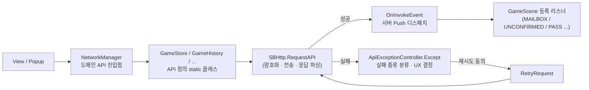

통신 계층의 예외 처리와 서버 Push(Invoke) 디스패치
==========================================================
> 모바일 환경에서는 통신 실패가 "예외적인 상황"이 아니라 "일상"이다. STARWAY 클라이언트는 모든 API 호출이
> `SBHttp.RequestAPI` 한 곳을 지나가도록 하고, 실패의 종류를 **`ApiExceptionController.Except` 한 곳**에서
> 분류해 사용자 경험(재시도 / 확인 / 재시작 / 스토어 이동)을 결정한다. 서버가 응답에 실어 보내는 갱신 신호
> (`InvokeKind`)도 같은 관문에서 리스너로 디스패치한다.

*이 문서에서 보여주려는 것*
> 1. 실패를 **전송 계층 / HTTP 상태 / 서버 응답 코드** 세 층으로 나눠 각각 다른 정책을 적용한 예외 처리 설계
> 2. `isRetry = true` 기본값 파라미터 하나로 **기존 호출부를 하나도 고치지 않고** UX 분기를 추가한 API 확장 (OCP)
> 3. 서버 Push(`InvokeKind`)를 `Dictionary<InvokeKind, Action<InvokeDto>>` 리스너로 받는 구조와, 실서비스에서 발견한 `CP` 디스패치 이슈 수정
> 4. 타임아웃/재시도 값을 실측으로 반복 조정한 커밋 이력

샘플 코드 (실제 프로젝트에서 그대로 가져옴)
> [`Http.cs`](./Http.cs) · [`ApiExceptionController.cs`](./ApiExceptionController.cs) · [`InvokeKind.cs`](./InvokeKind.cs) · [`InvokeDto.cs`](./InvokeDto.cs)

---

전체 구조
------------


모든 API 정의 클래스는 아래처럼 얇게 유지하고, 공통 정책은 전부 `SBHttp`와 `ApiExceptionController`가 가진다. 새 API를 추가하는
사람은 예외 처리를 다시 짤 필요가 없다.

```csharp
// Server/Network/API/GameHistory.cs
public static void Ack(RequestDto<HistoryDto> data, Action<ResponseDto<String>> cb)
{
    SBHttp.RequestAPI<HistoryDto, String>(BestHTTP.HTTPMethods.Post, "/api/history/ack", data, (response) =>
    {
        cb(response);
    });
}
```

---

1. 한 관문 — `SBHttp.RequestAPI`
-----------------------------
```csharp
public static void RequestAPI<T1, T2>(HTTPMethods method, string path, RequestDto<T1> sendData,
                                      Action<ResponseDto<T2>> cb, bool isRetry = true)
{
    ...
    if (sendData != null)
        data = SBCrypto.Encrypt(JsonUtility.ToJson(sendData));        // 요청 본문 암호화

    Request(method, url, data, (code, text, req) =>
    {
        // 실패에 대비해 "기본 응답"을 먼저 만들어 둔다 (error: canRetry=true, needRestart=false, ...)
        ResponseDto<T2> response = new ResponseDto<T2>((UInt16)code, SBTime.Instance.ISOServerTime, new InvokeDto[0]);
        response.error = new ErrorDto(true, false, true);

        if (code != ResponseCode.OK)                                   // ① 전송/HTTP 실패
        {
            ApiExceptionController.Except(req, sendData, response, isRetry);
            cb(response);
            return;
        }
        response = JsonUtility.FromJson<ResponseDto<T2>>(text);
        if (response.invokes != null) OnInvokeEvent(response.invokes); // ③ 서버 Push 디스패치
        ...
        if (response.code != 200)                                      // ② 서버 응답 코드 실패
            ApiExceptionController.Except(req, sendData, response, isRetry);

        cb(response);
    });
}
```
> 호출자에게는 **항상 `cb(response)`가 호출된다.** 실패 시에도 `response.code`가 채워진 채로 돌아오므로, 호출부는 성공 분기만 신경 쓰고
> 실패 UX는 예외 컨트롤러가 이미 처리했다는 전제로 코드를 쓸 수 있다.

---

2. 실패의 세 층 — `ApiExceptionController.Except`
------------------------------------------------
| 층 | 판별 기준 | 처리 정책 |
|----|-----------|-----------|
| 전송 계층 | `HTTPRequestStates.ConnectionTimedOut / TimedOut / Error` | 로딩 인디케이터 정리 후 **재시도 팝업** (`OpenApiErrorRetryPopup`) |
| HTTP 상태 | 요청은 완료됐지만 `StatusCode != 200` | `isRetry == true`면 재시도 팝업, `false`면 **확인 팝업만** |
| 서버 응답 코드 | HTTP 200 이지만 `resData.code != OK` | 코드별 정책 (아래) |

서버 응답 코드별 정책은 "사용자가 다음에 무엇을 해야 하는가"를 기준으로 갈린다.

| 응답 코드 | 사용자에게 필요한 다음 행동 | 처리 |
|-----------|----------------------------|------|
| `NeedUpdateSheet` | 기획 데이터 갱신 | 안내 팝업 → `GameScene.OnRestart()` |
| `NeedUpdateStore` | 앱 업데이트 | 업데이트 팝업 → 스토어 URL 오픈 후 앱 종료 |
| `AuthSuspend/Block/DropAccount` | 로그인 정보 폐기 | 안내 팝업 → 사용자 PlayerPrefs 삭제 후 재시작 |
| `AuthInvalid/ExpiredToken`, `SSOVerifyFail` | 재로그인 | 안내 팝업 → (게스트가 아니면) 로그인 정보 삭제 후 재시작 |
| `GameWaitingResponseADReward` | 잠시 후 재시도, 단 **3회까지만** | `reqData.no > 3` 이면 확인 팝업으로 종료 |
| 그 외 | 서버가 내려준 `error` 플래그에 위임 | `canRetry` → 재시도 팝업, `needRestart` → 재시작 팝업 |

```csharp
// 마지막 줄기: 위의 개별 코드에 걸리지 않은 실패는 서버가 알려준 플래그를 따른다
if (resData.error.canRetry)
{
    ApiExceptionController.OpenApiErrorRetryPopup(resData.code, request, reqData);
}
else if (resData.error.needRestart)
{
    ViewController.OpenRestartGamePopup(resData.code, (isOk) => { GameScene.Instance.OnRestart(); });
}
```
> 클라이언트가 모든 에러 코드의 의미를 알 필요는 없다. **클라이언트가 직접 판단해야 하는 소수의 코드**(업데이트/계정/토큰)만
> 위에서 처리하고, 나머지는 서버가 내려주는 `ErrorDto(canRetry, needRestart, ...)` 플래그를 따르는 구조라서 서버에 새 에러 코드가
> 추가돼도 클라이언트 배포 없이 "재시도 가능한가 / 재시작이 필요한가"를 서버 쪽에서 조절할 수 있다.

### 재시도는 "사용자 동의 후, 새 요청 번호로"
```csharp
public static void RetryRequest<T>(HTTPRequest request, RequestDto<T> reqData)
{
    ...
    if (reqData != null)
    {
        reqData.no += 1;                                   // 재시도마다 요청 순번 증가
        reqData.time = SBTime.Instance.ISOServerTime;      // 서버 시각으로 갱신
        var rawData = SBCrypto.Encrypt(JsonUtility.ToJson(reqData));   // 갱신된 값으로 다시 암호화
        newReqeust.RawData = System.Text.Encoding.UTF8.GetBytes(rawData);
    }
    LoadingIndicator.Show();
    newReqeust.Send();
}
```
> 재시도는 자동으로 반복되지 않고 **팝업에서 사용자가 확인을 눌렀을 때만** 실행된다. 재시도할 때마다 요청 순번(`no`)을 올리고 시각을 서버 시각으로
> 갱신한 뒤 다시 암호화해서 보낸다. (결제 흐름 전체의 안전장치는 [IAPProcess.md](../../IAPProcess.md) 참고)

---

3. 기존 호출부를 깨지 않는 확장 — `isRetry`
-----------------------------------------
커밋 `7f52e7a40` (2023-04-04) "네트워크 에러 발생시 원하는 경우 재시도 팝업을 띄우지 않고 확인 팝업만 띄우게 하는 기능 추가"

```csharp
public static void RequestAPI<T1, T2>(HTTPMethods method, string path, RequestDto<T1> sendData,
                                      Action<ResponseDto<T2>> cb, bool isRetry = true)   // ← 추가된 파라미터

// ApiExceptionController.Except 내부 — HTTP 상태 실패 분기
if (isRetry)
    ApiExceptionController.OpenApiErrorRetryPopup(request.Response.StatusCode, request, reqData);
else
    ViewController.OpenApiErrorPopup(request.Response.StatusCode, 0, 0, 0, (isOk) => { });
```
> 호출에 따라서는 재시도 팝업이 오히려 사용자 경험을 해친다(재시도해도 같은 실패를 반복 경험하는 경우). 이 커밋은 `RequestAPI`와
> `Except`에 `bool isRetry = true` **기본값 파라미터**를 추가해서, (1) 기존 호출부는 한 줄도 수정하지 않고 종전 동작을 유지하면서
> (2) 필요한 호출부만 `false`를 넘겨 확인 팝업으로 바꿀 수 있게 했다. 커밋에서 함께 수정된 파일은 `ApiExceptionController.cs`,
> `Http.cs`, `ViewController.cs`, `GameCoupon.cs`, `GameConfigPopup.cs` 5개(+46 / -21줄)로, **API 시그니처 확장 + 새 팝업 진입점 +
> 첫 적용처**가 한 커밋에 묶여 있다.

---

4. 서버 Push(`InvokeKind`) 디스패치
--------------------------------
서버는 일반 API 응답의 `invokes` 배열에 "클라이언트가 갱신해야 할 것"(우편함, 구독, 미확인 보상, 패스, 미션, 팝업스토어 …)을 실어 보낸다.
클라이언트는 별도 폴링 없이 **어떤 API 응답이든 받는 순간** 이를 처리한다.

```csharp
private static Dictionary<InvokeKind, Action<InvokeDto>> invokeListener = ...;

/// 하나의 invoke에 하나의 리스너만 등록 가능 함.
public static void AddInvokeListener(InvokeKind kind, Action<InvokeDto> invokeDto)
{
    if (invokeListener.ContainsKey(kind))
    {
        SBDebug.Log("... 중복된 이벤트 등록을 시도하였습니다.");
        return;                                    // 중복 등록은 무시하고 경고만
    }
    invokeListener.Add(kind, invokeDto);
}

private static void OnInvokeEvent(InvokeDto[] invokes)
{
    for (int i = 0, len = invokes.Length; i < len; i++)
    {
        InvokeDto invoke = invokes[i];
        if (invoke.kind == InvokeKind.CP)          // CP 는 값만 갱신하고 리스너 호출 없이 다음으로
        {
            CP = invoke.value.ToString();
            continue;
        }
        if (!invokeListener.ContainsKey(invoke.kind))
        {
            SBDebug.Log("... 이벤트 처리가 누락되었습니다. 해당 이벤트 처리가 필요합니다.");
            continue;                              // 리스너가 없어도 죽지 않고 경고만
        }
        invokeListener[invoke.kind](invoke);
    }
}
```
리스너를 등록하는 쪽은 `GameScene`이다. 씬이 살아있는 동안만 구독하고, 종료 시 짝을 맞춰 해제한다.
```csharp
// GameScene.cs — 등록
SBHttp.AddInvokeListener(InvokeKind.MAILBOX,     this.RefreshMailBox);
SBHttp.AddInvokeListener(InvokeKind.UNCONFIRMED, this.AccumulateUnConfirmedInvokes);
SBHttp.AddInvokeListener(InvokeKind.PASS,        this.AccumulateUnreceivedPassReward);
...
// GameScene.cs — 해제 (OnClose)
SBHttp.RemoveInvokeListener(InvokeKind.MAILBOX);
SBHttp.RemoveInvokeListener(InvokeKind.UNCONFIRMED);
...
```

**실서비스에서 발견한 버그 — `40b738302` (2022-08-23)** "InvokeKind가 CP인 경우 InvokeListener가 호출되지 않는 이슈 수정"
> `CP` 종류는 일반 리스너 호출 대신 `SBHttp.CP` 값만 갱신하고 다음 Invoke 로 넘어가는 특수 케이스다. 현재의
> `if (invoke.kind == InvokeKind.CP) { ...; continue; }` 분기가 이 커밋(`Http.cs` 2줄 변경)을 거쳐 만들어졌다.
> 디스패처가 **"리스너가 없는 종류"를 에러가 아닌 경고로 다루도록** 설계돼 있기 때문에, 서버가 새 Invoke 종류를 먼저 배포해도 구버전
> 클라이언트가 죽지 않는다는 점이 이 구조의 장점이다.

Invoke 는 보상 Ack 안전장치와도 이어진다. 서버는 클라이언트가 `Ack`를 보내기 전까지 `UNCONFIRMED` Invoke 로 "확인되지 않은 결과가 있다"는
신호를 계속 내려보내고, 클라이언트는 이를 `GameScene.unreceived*Reward` 목록에 (중복 제거하며) 쌓아 두었다가 로비에서 처리한다.
→ [IAPProcess.md의 "미수령 보상 복구"](../../IAPProcess.md#미수령-보상-복구--로비의-ackcheck-상태)

---

5. 타임아웃·재시도 값은 실측으로 조정했다
------------------------------------------
현재 코드에 남아있는 값
> * 일반 API 요청: `request.Timeout = 30초` (`Http.cs`)
> * 파일 스트리밍 다운로드: `EnableTimoutForStreaming = true`, `Timeout = 500초` (`Http.cs`)
> * 리소스 다운로드 연결: `ConnectTimeout = 15초` + 진행 정체 감시 코루틴 (`TitleScene.cs`, 자세한 내용은 [AdditionalResourceDownload.md](../../AdditionalResourceDownload.md))

이 값들이 한 번에 정해진 것이 아니라는 것은 커밋 이력에서 확인된다.

| 일시 | 커밋 | 내용 |
|------|------|------|
| 2023-02-22 12:25 | `8b419c4eb` | 리소스 다운로드시 네트워크 불안정에 대한 대응 (재시도 로직 도입, +24줄) |
| 2023-02-22 12:32 | `0dade312d` | 네트워크 불안정시 재시도 횟수 수정 (도입 7분 뒤 임계값 조정) |
| 2023-02-22 20:51 | `2712f4377` | Timeout 시간 수정 |
| 2023-02-23 00:29 | `99cca0970` | Timeout 시간 조정 (다음 날 재조정) |
| 2023-04-04 12:40 | `7f52e7a40` | 재시도 팝업을 선택적으로 생략하는 `isRetry` 도입 |

> 재시도 로직을 넣고 7분 만에 임계값을 고치고, 같은 날 저녁과 자정에 타임아웃을 다시 조정한 흔적은 "이론으로 정한 값"이 아니라 **QA/실기기에서
> 관측한 값으로 수렴시킨 과정**에 가깝다.

---

한계와 개선 방향
------------------
> 실서비스 코드라서 남아있는 아쉬움도 함께 적어둔다. 지금 다시 설계한다면 이렇게 바꾸고 싶다.
> * `Except`는 응답 코드별 `if / else if` 체인(약 130줄)이다. `ResponseCode → { 팝업 종류, 재시작 여부, 로그인 정보 삭제 여부 }` **정책 테이블(또는
>   정책 객체)** 로 옮기면 새 코드 추가가 데이터 한 줄이 되고 단위 테스트도 쉬워진다.
> * `isRetry`는 "HTTP 상태 != 200" 분기에만 적용된다. 타임아웃/연결 오류 분기는 항상 재시도 팝업이다. 정책 객체가 생기면 세 층 모두에 같은
>   옵션을 일관되게 적용할 수 있다.
> * 콜백 기반 API라서 호출부에서 `async/await`로 이어 쓰기 어렵다. `UniTaskCompletionSource`로 감싼 `RequestAPIAsync`를 두면 호출부의 콜백 중첩을
>   줄일 수 있다 (퍼즐 로직에서 이미 Coroutine → UniTask 전환을 경험했기에 같은 방식으로 접근할 수 있다).
> * 사용되지 않는 `IsCheckExcept / CheckExcept`와 주석 처리된 이전 구현이 남아있다 (정리 대상).

---

커밋 근거
------------
`git log --author=seojoonwon` 로 확인되는 이 문서 관련 커밋

| 커밋 | 날짜 | 설명 |
|------|------|------|
| `40b738302` | 2022-08-23 | InvokeKind가 CP인 경우 InvokeListener가 호출되지 않는 이슈 수정 (`Http.cs`) |
| `8b419c4eb` | 2023-02-22 | 리소스 다운로드시 네트워크 불안정에 대한 대응 (`NetworkManager.cs`, `TitleScene.cs`) |
| `0dade312d` | 2023-02-22 | 네트워크 불안정시 재시도 횟수 수정 |
| `2712f4377`, `99cca0970` | 2023-02-22/23 | Timeout 시간 수정/조정 (`Http.cs`, `TitleScene.cs`) |
| `7f52e7a40` | 2023-04-04 | 재시도 팝업 생략 옵션(`isRetry`) 추가 — 5개 파일 +46 / -21 |
| `e581a7ddd` | (1.0.3 브랜치) | 인게임에서 클리어 보상 ACK 처리 없이 나간 경우, 로비에서 Invoke 정보로 미수령 보상 처리 |

관련 문서: [IAPProcess.md](../../IAPProcess.md) · [AdditionalResourceDownload.md](../../AdditionalResourceDownload.md) · [02. TitleSequence](../02.%20TitleSequence/readme.md)
