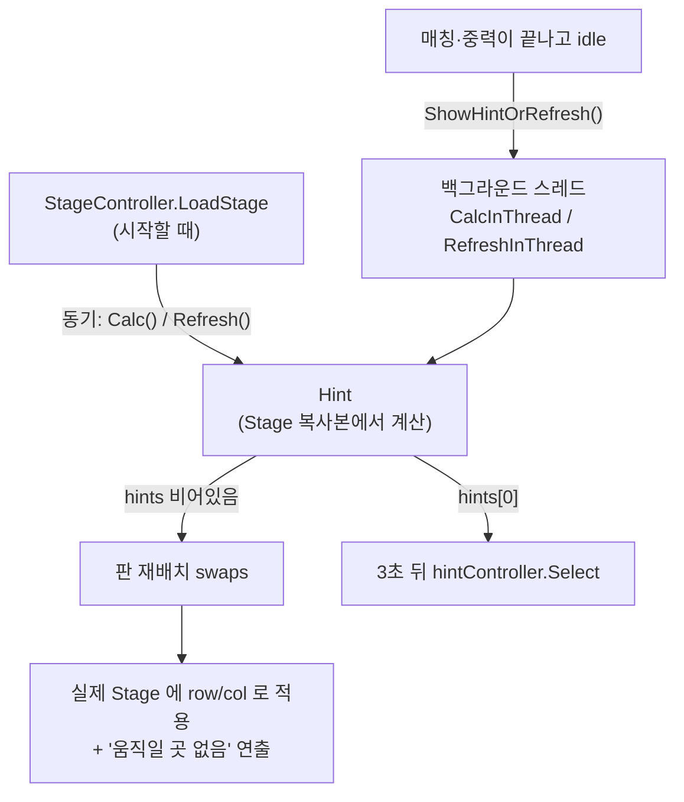

퍼즐 코어 — 힌트 계산(Hint)과 스테이지 데이터(StageInfoFiles)
===========================================================
> 3Match 퍼즐에서 "지금 맞출 수 있는 곳이 있는가, 없으면 판을 어떻게 다시 깔 것인가"를 계산하는 `Hint` 와, 스테이지를 JSON 으로 정의한 `StageInfoFiles` 를 설명한다.
> 퍼즐 코어 알고리즘(매칭, 중력, 특수 블록)은 직접 설계했다고 주장하는 영역이 아니라, 코드를 읽고 구조를 설명하는 **"구조 이해"** 범주다
> ([100.Docs/02.설계패턴](../100.Docs/02.%EC%84%A4%EA%B3%84%ED%8C%A8%ED%84%B4/readme.md) 의 "직접 설계 / 확장 / 이해" 구분과 같은 기준). 아래 "한계와 개선 방향"도 그 관점에서 읽으면 된다.

이 폴더의 파일과 문서
---------------------
| 파일 | 역할 | 설명 문서 |
|------|------|-----------|
| [`StageController.cs`](./StageController.cs) | 스테이지 로딩·초기화, 입력, 매칭/중력 루프 | [PuzzleInit.md](../PuzzleInit.md) |
| [`BlockController.cs`](./BlockController.cs) | 블록 하나의 화면 오브젝트(이동, 피격, 폭파) | [BlockMatchLogic.md](../BlockMatchLogic.md) |
| [`IngameBlockPoolController.cs`](./IngameBlockPoolController.cs) | 블록 오브젝트 풀링 | [100.Docs/01.최적화](../100.Docs/01.%EC%B5%9C%EC%A0%81%ED%99%94/readme.md) |
| [`Hint.cs`](./Hint.cs) | 가능한 이동 탐색, 판 재배치 | **이 문서** |
| [`StageInfoFiles/`](./StageInfoFiles) | 스테이지 정의 JSON 샘플 | **이 문서** |

---

Part 1. 스테이지 데이터 — `StageInfoFiles/*.json`
==================================================
스테이지는 코드가 아니라 **JSON 데이터**다. `StageController.LoadStage(JObject)` 가 이 JSON 을 `Stage` 객체로 읽고([PuzzleInit.md](../PuzzleInit.md)), 이후 화면 오브젝트를 만든다.
샘플은 세 종류(일반 스테이지 `normal_*`, 스코어 모드 `scoremode_*`, 미션 스테이지 `starway_*`)이다.

```jsonc
{
  "header": {                        // 판 크기, 제한, 모드, 데이터 버전
    "name": "normal_1", "rowCount": 4, "colCount": 4,
    "totalTurn": "15",               // 이동 가능 횟수
    "skillFeverMax": "70",           // 카드 스킬 게이지 최대치
    "isAutoOneZone": true,
    "version": "1.0.28", "createdAt": "2022-08-02T15:03:01.978Z"
  },
  "clears": [ {"type":105,"total":7}, {"type":0,"total":0}, {"type":0,"total":0} ],   // 클리어 조건 (목표 종류, 개수) 최대 3칸
  "components": { "ALL": [ {"type":103}, {"type":104}, {"type":105,"normalPoint":1}, {"type":101} ] },  // 랜덤 블록의 후보 풀
  "genesises": [ {"row":0,"col":0,"type":1,"blocks":[{"type":902,"componentName":"ALL"}]}, ... ],       // 위에서 새 블록이 생성되는 셀
  "zones": [ {"left":0,"top":0,"right":3,"bottom":3} ],
  "cells": [ [ {"block":{"type":101,"normalPoint":1}}, ... ], ... ]                                     // 행 × 열의 초기 배치
}
```
| 필드 | 의미 |
|------|------|
| `header` | 판 크기(`rowCount`/`colCount`), 이동 횟수(`totalTurn`), 스킬 게이지 최대치(`skillFeverMax`), 모드(`mode`), 데이터 버전(`version`) |
| `clears` | 클리어 조건. `type` 은 블록/목표 종류 코드, `total` 은 필요한 개수. 조건 없는 칸은 `{"type":0,"total":0}` |
| `components` | **이름 붙은 블록 후보 풀**. 셀에 "랜덤"으로 적어 두면 실행 시점에 이 풀에서 뽑아 채운다 ([PuzzleInit.md](../PuzzleInit.md)의 `BlockType.Random` + `componentName` 구조) |
| `genesises` | 위쪽에서 새 블록이 공급되는 셀 목록(샘플에서는 `blocks` 에 풀 이름 `ALL` 을 가리키는 랜덤 블록으로 보이는 코드 `902` 가 들어 있다) |
| `zones` | 판을 나누는 구역 범위(샘플은 모두 판 전체를 한 구역으로 지정, `isAutoOneZone: true`) |
| `cells` | 행 우선 2차원 배열. 셀마다 블록(`block`), 바닥/상단 오브젝트(`bottomBlock` 등), 셀 타입(`type`)을 가진다 |

### 세 샘플이 보여주는 것
| 파일 | 크기 | 특징 |
|------|------|------|
| `normal_1.json` | 4 × 4 | 가장 작은 4 × 4 샘플. `totalTurn` 15, 목표는 종류 코드 `105` 를 7개 |
| `scoremode_001.json` | 11 × 9 | 스코어 모드 스테이지. `totalTurn` 이 `0` 이고 `mode` 가 `1` 이다. `StageController` 에 `Mode.TimeAttack` 분기가 있고, 이 데이터의 `header.name` 이 `timeattack_001` 인 것으로 보아 스코어 모드가 타임어택 모드를 재사용해 만들어졌다고 읽힌다 |
| `starway_425.json` | 9 × 9 | 미션 스테이지. `clears` 에 두 종류의 목표가 각 56개로 걸려 있고, 블록 `703` 56개가 바닥 쪽 오브젝트(`bottomBlock: 704`) 위에 겹쳐 배치되어 있다. 일부 셀은 `{"type":2}` 로만 적혀 있어 다른 셀(`type: 1`, 코드에서 `CellType.Alive` 와 비교되는 값)과 종류가 다르다 |

### 데이터 설계에서 읽히는 것
* **콘텐츠 제작과 코드가 분리되어 있다.** 스테이지 추가는 JSON 추가로 끝나고, 랜덤 후보 풀(`components`)만 바꿔도 밸런스가 바뀐다. 헤더에 `version`(`1.0.28`, `2.2.6`, `2.3.2`)과
  `createdAt` 이 있는 것은 스테이지 제작 도구가 만든 산출물이고, 도구 버전이 올라가며 포맷이 확장되었다는 뜻으로 읽힌다.
* **파일 이름과 `header.name` 이 일치하지 않는다.** `starway_425.json` 의 `header.name` 은 `normal_823`, `scoremode_001.json` 의 `name` 은 `timeattack_001` 이다. 내보낼 때 파일명 규칙이 달랐거나 복사해서 재사용한 결과로 보인다.
* **값의 타입이 섞여 있다.** `normal_1.json` 은 `"totalTurn": "15"`, `"skillFeverMax": "70"` 처럼 문자열이고 다른 파일은 숫자다. 읽는 쪽(`Stage.FromJObject`)이 두 형태를 모두 받아야 하므로,
  데이터 검증 도구나 JSON 스키마가 있으면 안전하다.

---

Part 2. 힌트 — `Hint.cs`
=========================
> 3Match 는 "움직일 곳이 없는 판"이 되면 게임이 막힌다. `Hint` 는 **① 지금 가능한 이동/터치를 모두 찾고, ② 하나도 없으면 판을 다시 깔아서 반드시 하나 이상 생기게** 한다.
> 이 결과로 (가) 일정 시간 입력이 없을 때 힌트 표시, (나) 스테이지 시작 시 매칭이 없는 판 방지, (다) 이동 후 막힌 판 재배치를 한 클래스로 처리한다.

호출 흐름
-----------


1. 실제 판을 건드리지 않고 복사본에서 계산한다
----------------------------------------------
```csharp
public Hint(Stage stage)
{
    // Stage 객체를 하나 복사해서 저장 후 계산해준다.
    JObject obj = stage.ToJObject();
    this.stage = Stage.Factory(obj);
}
```
* 힌트 계산은 후보 이동마다 **블록을 교환해 보고 매칭을 분석한 뒤 되돌리는** 작업이다(`ChangeBlocks(from, to)` → `Analyse` → `ChangeBlocks(from, to)`). 이것을 진행 중인 판에서 하면 화면과 충돌하므로,
  스테이지를 스냅샷으로 복제한 사본에서만 계산한다.
* 복제는 스테이지 파일을 읽는 것과 **같은 직렬화 경로**(`ToJObject` → `Stage.Factory`)를 재사용한다. 복제 전용 코드를 따로 만들지 않아서, 새 필드가 직렬화 대상에 들어가면 복제에도 자동으로 반영된다.
* 사본은 원본과 참조가 다른 별개의 객체이므로, 호출부(`StageController.ShowHintOrRefresh`)는 결과를 적용할 때 **`row`/`col` 로 실제 판의 셀을 다시 찾아** 반영한다(코드 주석의 "문맥이 다르므로").

2. 가능한 움직임 탐색 — `GetMatchNormalBlocks`
----------------------------------------------
```csharp
foreach (Cell to in cells4)                                    // 상·우·하·좌 네 방향
{
    if (this.stage.IsDefancedByWall(from, to)) continue;       // 사이에 벽이 있으면 교환 불가
    if (null != to.block && BlockAttr.Movable != to.block.attr && null == to.topBlock) continue;
    if (to.topBlock == null && to.block != null)
    {
        this.stage.ChangeBlocks(from, to);                      // 교환하고
        var matchResults = match.Analyse(new Cell[] { to });    // 그 셀에서 매칭이 생기는지 분석하고
        this.stage.ChangeBlocks(from, to);                      // 원복한다
        foreach (var r in matchResults)
            this.hints.Add(new HintResult(from, to, HintType.MoveNormal, r));
        match.Clear();
    }
}
```
* 시작 셀 조건: 살아있는 셀 + 일반 블록 + `Movable` + **위에 덮인 오브젝트(`topBlock`, 예: 감옥 창살)가 없을 것**. 창살이 덮인 일반 블록은 옮길 수 없는 영역으로 취급한다(코드 주석).
* 교환할 수 있는지는 벽 유무(`IsDefancedByWall`), 상대 블록의 이동 가능 여부로 거른다. 실제 조작 입력(`StageController` 의 `IsDefancedByWall` 검사)과 같은 조건을 쓰므로 힌트와 실제 조작 규칙이 어긋날 가능성을 줄인다.
* 일반 블록 이동이 하나도 없을 때만 **특수 블록 터치**(`GetSpecialBlocks`)를 힌트로 쓴다. 단, 미러볼은 상하좌우에 일반 블록이 없으면 터치해도 소용이 없으므로 제외한다.
* 결과는 **가중치 내림차순**으로 정렬한다. 가중치는 특수 블록 터치이면 블록 타입 값, 일반 이동이면 매칭 결과 타입 값이다. 즉 더 큰 매칭이 앞에 오고 `hints[0]` 이 대표 힌트가 된다.

3. 막힌 판 재배치 — `Refresh`
------------------------------
힌트가 하나도 없으면 일반 블록을 **다시 깔아서** 최소 한 번은 움직일 수 있는 판을 만든다. 무작위로 채운 뒤 검증하는 **생성-검증(generate-and-test)** 방식이다.
```csharp
for (n = 0; n < limit; n++)                        // 최대 200회
{
    this.swaps = this.RefreshNormalBlock();        // 1) 일반 블록을 다시 깔고
    this.Calc();                                   // 2) 움직일 곳이 있는지 계산하고
    matchResults = new NormalMatch(this.stage).AnalyseAll();   // 3) 이미 3개가 이어진 곳이 없는지 확인
    if (0 == mr && 0 < this.hints.Count) break;    // 이미 맞춰진 곳은 없고, 움직일 곳은 있으면 성공
}
```
`RefreshNormalBlock` 안에서는 두 가지 규칙이 함께 적용된다.
* **움직일 곳을 만든다.** 재배치 대상 일반 블록 중 3칸을 무작위로 골라 같은 종류로 채운다.
* **이미 맞춰진 곳을 없앤다.** 나머지 셀은 `_Exclude(r, c)` 로 **위쪽 셀, 왼쪽 셀과 다른 종류**만 뽑아 채운다. 판을 위→아래, 왼→오른 순서로 채우므로 이 두 방향만 보면 새로 깐 일반 블록끼리는 가로·세로 3연속이 생기지 않는다(마지막 `AnalyseAll` 이 이를 다시 검증한다).
* 변경한 셀은 `SwapBlock(cell, beforeBlock, afterBlock)` 목록으로 돌려준다. 호출부는 이 목록으로 화면 블록을 `SwapNewBlock` 하므로, **계산과 연출이 분리**된다.
* `CellAttr.NoRefresh` 셀(고정 오브젝트)은 재배치 대상에서 제외한다.

4. 메인 스레드를 막지 않는다
----------------------------
```csharp
// StageController.ShowHintOrRefresh (UniTask)
hint.CalcInThread();
while (hint.isCalcing) await UniTask.NextFrame();     // 계산이 끝날 때까지 프레임마다 양보
...
await UniTask.Delay(TimeSpan.FromSeconds(3f));
if (this.dirtyCount != myDirtyCount || this.stage.IsCleared) throw new OperationCanceledException();
```
* 판이 크면 힌트 계산(모든 셀 × 4방향 × 교환·분석)이 무겁기 때문에 `Thread`(백그라운드)에서 계산하고, 메인은 `UniTask.NextFrame()` 로 프레임을 양보하며 기다린다. 계산 중에는 `lockHint` 로 입력을 막는다.
* `dirtyCount` 는 "문맥 카운터"다. 힌트를 3초 뒤에 보여주는 사이 사용자가 블록을 건드렸다면 카운터가 바뀌어 **낡은 힌트를 버린다.**
* 스테이지 시작 시(`LoadStage`)는 동기 흐름 안에서 실행되므로 스레드 없이 동기 버전(`Calc()`/`Refresh()`)을 쓴다.

---

한계와 개선 방향
------------------
> * **`isCalcing`/`isRefreshing` 은 스레드 사이에서 공유되지만 `volatile` 도 아니고 락도 없다.** 한 번에 한 계산만 돌고 메인은 폴링만 하는 구조라 실제로 문제가 될 가능성은 낮지만,
>   `UniTask.RunOnThreadPool` 로 계산을 감싸 `await` 하면 폴링 루프와 플래그가 모두 사라지고 취소 토큰도 붙일 수 있다.
> * **`Refresh` 가 실패하는 경우를 호출부가 처리하지 않는다.** 200회 안에 조건을 만족하는 판을 못 만들면 그대로 끝나는데, 이후 `ShowHintOrRefresh` 는 `hint.hints[0]` 을 읽으므로
>   `hints` 가 비어 있으면 예외가 날 수 있다(가능성은 낮지만 방어 코드가 필요하다). 재배치 실패 시 재시도 횟수 상향이나 강제 해법(직접 매칭 배치)이 있어야 한다.
> * **`_Exclude` 는 후보 종류가 2개 이하이면 무한 루프가 될 수 있다.** 위/왼쪽 블록과 다른 종류만 고르도록 `for (;;)` 로 반복하는데, 후보 풀이 두 종류이고 위·왼쪽이 서로 다른 종류라면 통과할 값이 없다.
>   샘플 스테이지는 모두 4~5종이라 실제로는 발생하지 않지만, 제작 도구에서 후보 수를 3종 이상으로 검증하는 것이 안전하다.
> * **코드와 주석이 어긋난 곳이 있다.** `RefreshNormalBlock` 의 주석은 "연속하는 두 셀에 동일한 블록"인데 실제 코드는 무작위로 고른 3칸을 같은 종류로 채운다. 이 3칸이 우연히 3연속이면 `AnalyseAll` 검증에서 걸려 재시도된다.
> * **`Hint` 클래스에 탐색, 재배치, 스레드 제어가 함께 있다.** `HintFinder`(탐색)와 `BoardShuffler`(재배치)로 나누면 각각 단위 테스트가 가능하다.
> * **메서드 이름/표기 정리 대상이 있다.** `IsDefancedByWall`(Defenced 오타 추정), 디버그용 주석 로그 등.

관련 문서: [PuzzleInit.md](../PuzzleInit.md) (스테이지 JSON → 화면 오브젝트) · [BlockMatchLogic.md](../BlockMatchLogic.md) · [CardSkillBlockLogic.md](../CardSkillBlockLogic.md) (`getNormalCells → Explode → FactorySpecial` 패턴) · [100.Docs/01.최적화](../100.Docs/01.%EC%B5%9C%EC%A0%81%ED%99%94/readme.md)
