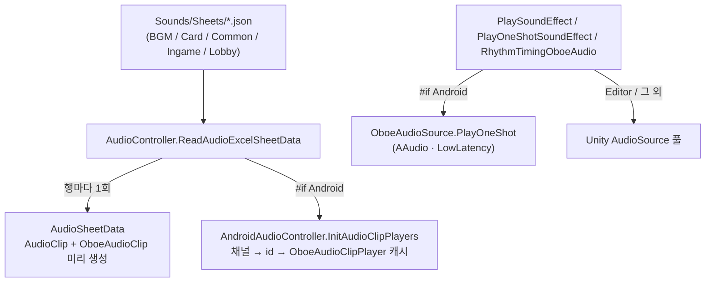

Android 저지연 오디오 — Oboe(AAudio) 연동
==========================================
> 리듬 게임(STARWAY iKON)과 퍼즐 이펙트 사운드는 **"누른 순간 소리가 나야" 하는** 콘텐츠다. Android 에서 Unity 기본 `AudioSource` 경로는
> 기기·출력 장치(특히 Bluetooth)에 따라 지연이 크게 늘어나서, Google 의 저지연 오디오 라이브러리 **Oboe(AAudio)** 를 연동해
> Android 에서만 별도 재생 경로를 만들었다.
>
> 실기기 측정 기준으로 Bluetooth 오디오 지연을 **약 1.5초 → 0.5초 미만**으로 줄였다 (이력서 기재 수치 / 측정 환경은 특정 기기·이어폰 조합).

샘플 코드 (실제 프로젝트에서 그대로 가져옴)
> [`AndroidAudioController.cs`](./AndroidAudioController.cs) — Oboe 래퍼 (재생기 캐시, 초기화/해제) · [`AudioController.cs`](./AudioController.cs) — 채널/시트 기반 오디오 총괄, 플랫폼 분기

---

구조 한눈에 보기
------------------


1. 초기화 — 저지연 스트림을 한 번만 연다
-------------------------------------
```csharp
public void InitAudioSource()
{
    this.audioSource = new OboeAudioSource(
        48000,                       // 샘플레이트
        PerformanceMode.LowLatency,  // 저지연 모드
        SharingMode.Shared,          // 다른 앱과 오디오 장치 공유
        AudioApi.AAudio,             // Android 8.0+ 저지연 API
        384,                         // 버퍼 관련 파라미터 (Oboe 플러그인 기준)
        128
    );
}
```
> 스트림 옵션(`LowLatency` / `AAudio` / `Shared`)은 "가능한 한 빠르게, 다른 앱과 공존하면서" 라는 의도를 그대로 코드로 옮긴 것이다. 이 스트림은
> 게임 시작 시 한 번 만들고 모든 효과음이 공유한다.

2. 미리 만들어 두기 — 재생 시점에 할당하지 않는다
-----------------------------------------------
시트(JSON)의 각 행을 읽을 때 `OboeAudioClip` 을 함께 만들고, **채널 → 시트 id → 재생기** 2단 딕셔너리에 캐시한다.
```csharp
// 1차 분류 : 채널 이름, 2차 분류 : Sheet의 id
private Dictionary<AudioController.Channel, Dictionary<string, OboeAudioClipPlayer>> audioPlayers;

public void InitAudioClipPlayers(AudioController.Channel channel, string id, AudioClip audioClip)
{
    ...
    OboeAudioClip oboeAudioClip = new OboeAudioClip(audioClip);
    OboeAudioClipPlayer audioClipPlayer = new OboeAudioClipPlayer(oboeAudioClip);
    audioClipPlayer.Stop();

    this.audioSource.AddAudioPlayer(audioClipPlayer);                 // 스트림에 재생기 등록
    this.audioPlayers[channel].Add(id, audioClipPlayer);
}
```
> 효과음 하나를 재생하는 시점에는 딕셔너리 조회 + `PlayOneShot` 호출뿐이다. 퍼즐에서 블록이 한꺼번에 터지는 순간이나 리듬 게임의
> 노트 판정 순간에 클립 디코딩/객체 생성이 끼어들지 않게 하려는 구조로, 인게임 오브젝트 풀링과 같은 발상이다
> ([100.Docs/01.최적화](../100.Docs/01.%EC%B5%9C%EC%A0%81%ED%99%94/readme.md)).
> 해제도 대칭으로 `DisposeOboeAudio()` 가 캐시된 `OboeAudioClip` 을 순회하며 `Dispose()` 한다.

3. 재생 — 플랫폼 분기는 컴파일 타임에
------------------------------------
```csharp
public void PlayOneShotSoundEffect(string sheetName, int id, Action onFinished, int index, float volume = 1.0f)
{
    ...
#if !UNITY_EDITOR && UNITY_ANDROID
    OboeAudioClipPlayer oboeAudioClipPlayer = androidAudioController.GetAvailableAudioPlayer(SE_Type, id);
    oboeAudioClipPlayer.OboeAudioClip = targetAudioSheetData.oboeAudioClip;
    androidAudioController.AudioSource.PlayOneShot(oboeAudioClipPlayer.OboeAudioClip);   // Oboe 경로
#else
    AudioSource audioSource = this.GetAudioSourceZeroIndex(SE_Type, index);
    audioSource.clip = targetClip;
    audioSource.PlayOneShot(targetClip);                                                 // Unity 경로
#endif
}
```
| 플랫폼 | 효과음 재생 경로 |
|--------|------------------|
| Android (실기기 빌드) | `OboeAudioSource.PlayOneShot` — `AudioController.InitializeAudioSourcePools()` 에서도 Unity `AudioSource` 풀을 `Intro` 채널 2개만 만들고, 나머지 채널은 Oboe 재생기 캐시를 사용 |
| Editor, 그 외 플랫폼 | Unity `AudioSource` 풀 (채널별 5~10개) |

> `#if !UNITY_EDITOR && UNITY_ANDROID` 로 분기해서 **Oboe 관련 호출이 Android 실기기 빌드에만 컴파일**된다. 에디터에서는 Unity 경로로 그대로
> 개발·테스트할 수 있고, 다른 플랫폼 빌드에 네이티브 라이브러리 의존이 새어 들어가지 않는다. 반대로 말하면 **Oboe 경로는 에디터에서 검증할 수 없어**
> 실기기 테스트에 의존했다는 한계도 있다.

### 리듬 게임용 재생 — `RhythmTimingOboeAudio`
```csharp
OboeAudioClipPlayer oboeAudioClipPlayer = androidAudioController.GetTimingAudioPlayer(SE_Type, id);
oboeAudioClipPlayer.Volume = volume;
oboeAudioClipPlayer.Looping = true;
oboeAudioClipPlayer.OboeAudioClip = targetAudioSheetData.oboeAudioClip;
oboeAudioClipPlayer.Play();
...
// 클립 길이 + 1초 뒤에 정지시키고 onFinished 콜백
CoroutineTaskManager.AddTask(_InvokeAndroidAfter(onFinished, oboeAudioClipPlayer.OboeAudioClip.Length + 1.0f, oboeAudioClipPlayer, sheetName, id));
```
> 리듬 게임은 일반 효과음(`PlayOneShot`)과 별도로, 재생기를 `Looping` 으로 켜 두고 클립 길이 기준으로 정지시키는 전용 진입점을 쓴다.

---

한계와 개선 방향
------------------
> * **Oboe 는 Android 전용 라이브러리다.** 이 코드베이스에서 Oboe 경로는 Android 에만 있고, iOS 는 Unity `AudioSource` 경로를 그대로 쓴다.
> * `NormalizeSounds`(같은 소리가 겹쳐 재생될 때의 볼륨 보정)는 본문이 주석 처리된 채 남아있다. 겹침 소리 보정은 미완성 기능이다.
> * `AudioController.cs` 는 1,700줄이 넘는다. 시트 로딩 / 채널 풀 / 플랫폼별 재생 / 리듬 전용 재생이 한 클래스에 있어서, `IAudioBackend`(Unity / Oboe)로
>   나누고 `#if` 분기를 백엔드 선택 한 곳으로 모으고 싶은 구조다.
> * `PlayOneShot` 계열 코드가 시트 조회 → 재생기 조회 → 재생의 같은 뼈대를 세 번 반복한다.

관련 문서: [PopupUIPattern.md](../PopupUIPattern.md) (`Popup` 의 버튼 사운드 재생 지점) · [100.Docs/02.설계패턴](../100.Docs/02.%EC%84%A4%EA%B3%84%ED%8C%A8%ED%84%B4/readme.md)
