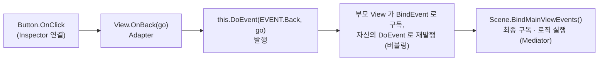

코드베이스의 설계 구조와 내가 맡은 부분
==========================================
> STARWAY 클라이언트(C# 파일 700여 개)는 6개 앱이 공유하는 코드베이스라서, "어떤 패턴을 알고 있는가"보다 **"이미 있는 구조를 정확히 읽고 그 규칙대로
> 확장하며, 필요한 곳에는 직접 구조를 만드는가"** 가 더 중요했다. 이 문서는 코드에서 확인되는 설계 구조를 정리하고, 각 구조에서 내가 한 일을
> 커밋 근거와 함께 구분해서 적는다.

*역할 표기 기준*
> * **직접 설계·구현** — 신규 파일/구조를 만든 것이 `git log` 로 확인되는 것
> * **확장·유지보수** — 기존 구조 위에서 기능을 추가하거나 버그를 고친 것이 커밋으로 확인되는 것
> * **구조 이해** — 이미 존재하던 코어 코드를 분석해 이해한 범위. (퍼즐 매치 판정/중력 같은 코어 알고리즘은 이 범주다. 커밋상 내 수정은 카드 스킬 UI 연동을 위한 소규모 변경 위주라서 "설계했다"고 적지 않는다.)

한눈에 보기
------------
| 구조 | 위치 | 한 줄 요약 | 역할 |
|------|------|-----------|------|
| Template Method + Factory Method | `View/Popup/Base/Popup.cs` | 팝업 공통 동작을 상위 클래스에, 생성은 `Popup.Load` 하나로 | 확장 (튜토리얼 보이스 선택/팝업 상점 등 신규 팝업 추가) |
| View 이벤트 계층 (Adapter → Observer → Bubbling → Mediator) | `View/Base/View.cs`, `*Scene.cs` | Button.OnClick 을 도메인 이벤트로 바꿔 Scene 에서 한 곳에 모아 처리 | 확장·구조 이해 |
| 제네릭 전역 이벤트 버스 | `Foundation/BroadcastTunnel.cs` | `BroadcastTunnel<K,V>` 로 View 트리 밖의 알림 전달 | 활용 (튜토리얼, 하트 충전 등) |
| 제네릭 FSM | `Controller/Scene/Base/Scene.cs` | `SetState<T>` 가 이전 상태의 태스크를 정리 | 확장 (로비 미수령 보상 복구, 커밋 `e581a7ddd`) |
| 오브젝트 풀 | `Controller/IngameBlockPoolController.cs` | 블록/이펙트 Instantiate·Destroy 제거 | **직접 설계·구현** |
| 통신 예외 정책 + Invoke 리스너 | `Server/Network/Http.cs`, `ApiExceptionController.cs` | 실패 3층 분류, `isRetry` 확장 | **직접 확장 (커밋 6건)** |
| Factory(불변식) / Singleton / Memento / 델리게이트 전략 배열 | `Artistar/Puzzle/Core/*` | 퍼즐 코어의 구조 | 구조 이해 + 카드 스킬 연동 |

---

1. Template Method + Factory Method — 팝업
-----------------------------------------
50종이 넘는 팝업을 `Popup` 상위 클래스가 공통 동작(로케일 텍스트, 버튼 사운드, 뒤로가기, 결과 콜백)을 맡고, 개별 팝업은 `OnOpen`/`OnTriggerOk` 등
`virtual` 만 오버라이드한다. 생성은 `Popup.Load(...)` 하나로 통일한다. → 자세한 코드와 설계 의도는 [PopupUIPattern.md](../../PopupUIPattern.md)

2. View 이벤트 계층 — Unity `Button.OnClick` 을 그대로 쓰지 않는다
------------------------------------------------------------
모든 View 는 `View` 베이스의 세 메서드로 이벤트를 다룬다.
```csharp
// View/Base/View.cs
public partial class View : MonoBehaviour
{
    public Dictionary<int, Action<int, object>> Events { set; get; }

    public void DoEvent<T>(T key, object go = null) { ... }          // 발행
    public void BindEvent<T>(T key, Action<int, object> action) { ... }   // 구독
    public bool RemoveEvent<T>(T key) { ... }                        // 해지 (0개가 되면 Events = null)
}
```
> 키가 `T key` 제네릭이고 `key.GetHashCode()` 로 저장되므로, View 마다 자기 `enum EVENT` 를 정의하면서도 인프라는 하나를 공유한다. `partial class` 로
> "이벤트 처리" 블록과 "기타" 블록을 나눠 둔 것도 눈에 띈다. (`BindEvent` 는 `Dictionary.Add` 로 구현돼 있어 같은 키를 두 번 구독하면 예외가 난다 —
> 리스트/스크롤 셀처럼 재사용되는 View 에서는 "이미 바인딩했는가" 플래그를 별도로 관리해야 하는 이유다.)

이벤트가 Scene 에 도달하는 흐름

```csharp
// MyCardScene.cs — View 트리 전체의 이벤트-핸들러 매핑이 한 메서드에 모여 있다
private void BindMainViewEvents()
{
    this.myCardView.MyCardMainView.BindEvent(MyCardMainView.EVENT.Back, (evt, arg) => { this.OnMainBack((GameObject)arg); });
    this.myCardView.MyCardMainView.BindEvent(MyCardMainView.EVENT.Deck, (evt, arg) => { this.OnDeck((GameObject)arg); });
    this.myCardView.MyCardMainView.MyCardMainCardView.BindEvent(MyCardMainCardView.EVENT.Sort,   (evt, arg) => { this.OnMyCardSort((GameObject)arg); });
    ...
}
private void RemoveMainViewEvents() { ... }      // 씬 종료 시 짝을 맞춰 해지
```
> View 는 Scene 의 존재를 모르고(단방향 의존), Scene 은 View 의 공개 이벤트만 안다. "어떤 UI 조작이 어떤 로직을 트리거하는가"가 `BindMainViewEvents` 한 곳에서
> 추적되기 때문에 화면이 커져도(`MyCardScene` 은 4,000줄이 넘는다) 진입점을 찾기 쉽다. `Popup` 도 `View` 를 상속하므로 같은 인프라 위에 있고,
> 결과 전달은 `OnResultCallback` 델리게이트를 쓴다.

3. `BroadcastTunnel<K, V>` — View 트리 밖의 알림
----------------------------------------------
```csharp
public static class BroadcastTunnel<K, V>
{
    private static Dictionary<K, List<Action<V>>> dict;
    public static void Notify(K key, V arg) { ... }
    public static void Add(K key, Action<V> receiver) { ... }
    public static void Remove(K key, Action<V> value)     // 리스트가 비면 키 제거, 딕셔너리가 비면 null 로
    public static void RemoveAll() { ... }
}
```
> 구독/해지를 **짝으로** 쓰는 것이 이 코드의 규칙이다. 예를 들어 `HeartAutoCharger` 는 초기화 때 `Add("...AddActiveItem", OnConsumeItemEvent)` 로 구독하고
> 종료 때 같은 키로 `Remove` 한다. 씬이 바뀌어도 정적(static) 딕셔너리에 델리게이트가 남아 죽은 객체를 호출하는 사고를 막는 규칙이다.
> 제네릭 타입 인자(`<string, int>` 등)마다 독립된 채널이 생기므로 페이로드 타입이 다르면 컴파일 타임에 분리된다.

4. 제네릭 FSM — `Scene.SetState<T>`
----------------------------------
```csharp
// Scene/Base/Scene.cs
protected void SetState<T>(T state)
{
    this.state = state.GetHashCode();
    var stateClose = this.stateCloseFunctor;
    this.stateCloseFunctor = null;      // 이전 상태가 등록한 Update 태스크/종료 태스크를 자동으로 비운다
    this.stateFunctor = null;
    if (stateClose != null) stateClose();
}
```
> 각 Scene 은 자기 `enum STATE` 를 정의하고 `StateChange(STATE to)` 가 `SetState(to)` 를 감싼다. 로비는 `ResizingCanvas → UpdatePlayerInfo → … → UpdateStageButton →
> AckCheck → CheckTutorialVideo → Done` 의 고정된 순서를 가지며, **`AckCheck`(미수령 보상 복구) 단계가 로비 초기화가 끝난 뒤 튜토리얼 영상 확인 앞에서** 실행된다
> (커밋 `e581a7ddd` 가 "인게임에서 Ack 없이 나간 경우 로비에서 처리"하도록 만든 복구 경로, [IAPProcess.md](../../IAPProcess.md#미수령-보상-복구--로비의-ackcheck-상태)). 상태 전이가 코드에 드러나 있으므로 "복구는 반드시 튜토리얼 영상 확인 전에"
> 같은 순서 제약을 `enum` 값 순서와 `StateChange` 호출 위치로 표현할 수 있다.

5. 퍼즐 코어의 구조 (구조 이해)
------------------------------
> 아래는 `Artistar/Puzzle/Core` 에서 읽어낸 설계다. 코어 알고리즘은 기존 코드이며, 나는 이 구조를 분석해 카드 스킬 UI 연동 등 신규 기능을 얹는 작업을 했다
> (예: `e06583202` 카드 스킬 블록 사용 후 카드가 회색으로 바뀌도록 `Block.cs`·`StageController.cs`·`CardSmallView.cs` 등 5개 파일 수정).

**Factory + private 생성자 — 불변식을 코드로 보장**
```csharp
private Block() : base() { ... }                       // 외부에서 직접 생성 불가

public static Block Factory(JObject obj)
{
    Block block = new Block();
    block.FromJObject(obj);
    block.uniqKey = Block._uniqKey++;                  // 모든 인스턴스가 고유 키 채번을 거친다
    return block;
}
public static Block FactorySpecial(BlockType type) { ... }   // 특수 블록용
public static Block FactoryWeeds() { ... }                   // 잔디 블록용
```

**Base 의 직렬화 계약 + Memento(Undo/Redo)**
```csharp
public class Base : System.Object
{
    public virtual JObject ToJObject()            { throw new NotImplementedException(); }
    public virtual void FromJObject(JObject obj)  { throw new NotImplementedException(); }
}

public class UndoManager                          // private 생성자 + static 접근자 (Singleton)
{
    List<JObject> undos, redos;
    public void Snap()  { undos.Add(Stage.singleton.ToJObject()); redos.Clear(); }
    public JObject Undo()
    {
        redos.Add(Stage.singleton.ToJObject());        // 현재 상태를 redo 로
        JObject prev = undos[undos.Count - 1]; undos.RemoveAt(undos.Count - 1);
        Stage.singleton.Clear();
        Stage.singleton.FromJObject(prev);              // 스냅샷 복원
        return prev;
    }
}
```
> `Block`, `Cell`, `Stage` 등 모든 도메인 모델이 `Base` 의 직렬화 계약을 따르므로 `UndoManager` 는 `Stage` 의 내부 필드를 전혀 모른 채 스냅샷을 찍고 복원한다.
> (`StageController` 안의 일부 `UndoManager` 호출은 `#if UNDO_MANAGER` 컴파일 심볼 아래에 있다.)

**델리게이트 배열 전략 — 매치 판정의 우선순위와 OCP**
```csharp
private delegate bool Getter(Zone zone, Cell me, out Cell[] result, out MatchType matchType);
private Getter[] getters;

// 당연하지만, 매칭 순서가 중요하다.
this.getters = new Getter[8] {
    new Getter(this.GetSpecialFinaleMatch),
    new Getter(this.GetSpecialLaserMatch),
    new Getter(this.GetSpecialBombWith4Match),
    new Getter(this.GetSpecialBombMatch),
    new Getter(this.GetSpecialCrossMatch),
    new Getter(this.GetSpecialTargetWith3Match),
    new Getter(this.GetSpecialTargetMatch),
    new Getter(this.GetNormalMatch),
};
```
> 8종류의 매치 판정 함수를 우선순위 순으로 배열에 담고 `AnalyseAll()` 이 순회한다. 새로운 매치 패턴을 넣을 때는 판정 함수 하나를 만들어 배열의 알맞은 위치에
> 끼워 넣으면 되고 호출부는 바뀌지 않는다. 실제로 이 순서 제약("특수 매치가 일반 매치보다 먼저")이 코드에 배열 순서로 드러나 있다. 이 파이프라인 위에서 미션 블록/카드
> 스킬이 어떻게 동작하는지는 [BlockMatchLogic.md](../../BlockMatchLogic.md), [CardSkillBlockLogic.md](../../CardSkillBlockLogic.md) 를 참고.

---

이 문서에서 얻어갈 것
------------------------
> 패턴 이름보다 **"그 패턴이 어떤 비용을 줄이는가"** 를 기준으로 정리했다. 팝업 상속 구조는 50종 팝업의 중복 구현 비용을, View 이벤트 계층은 화면-로직 사이의 결합 비용을,
> 제네릭 FSM 과 델리게이트 배열은 "순서가 중요한 절차"를 코드로 드러내는 비용을 줄인다. 그리고 이런 구조가 이미 있는 팀 코드에서는 새 구조를 들이기보다 **기존 규칙(구독/해지의 짝,
> 상태 전이 위치, 기본값 파라미터로의 확장)을 지켜서 넣는 것**이 대부분의 실무였다 — `isRetry` 확장과 로비 미수령 보상 복구가 그 사례다.

관련 문서: [PopupUIPattern.md](../../PopupUIPattern.md) · [IAPProcess.md](../../IAPProcess.md) · [05.Network/03.ApiException](../../05.Network/03.ApiException/readme.md) · [100.Docs/01.최적화](../01.%EC%B5%9C%EC%A0%81%ED%99%94/readme.md)
