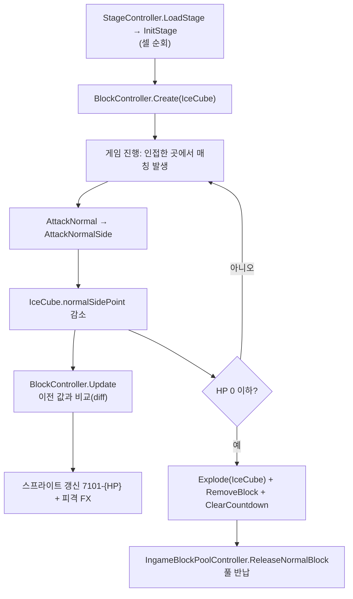

미션 블록 처리 — IceCube 로 보는 피격 · 표시 · 파괴 파이프라인
==============================================================
> 3Match 스테이지에는 일반 블록 외에 "옆에서 맞춰야 부서지는" **미션 블록**(나무상자, 얼음 큐브, 화분 등)이 있다. 이 블록들은 HP(`normalSidePoint`)를 갖고, 주변에서 매칭이 일어날 때마다 줄어들며,
> 0 이 되면 파괴 연출과 함께 클리어 조건(`ClearType`)이 차감된다. 이 문서는 `IceCube` 하나를 따라가며 **생성 → 피격 → 화면 반영 → 파괴 → 풀 반납**의 전 과정을 코드로 보여준다.
>
> 퍼즐 코어는 직접 설계했다고 주장하는 영역이 아니라 코드를 읽고 구조를 설명하는 "구조 이해" 범주다([100.Docs/02.설계패턴](./100.Docs/02.%EC%84%A4%EA%B3%84%ED%8C%A8%ED%84%B4/readme.md) 참고).

* **동일 기능 파생 블록**(4자리 타입: `IceCube = 7101` 등)을 베이스 타입(`Woodbox = 710`)과 같은 처리 경로에 편입시켜, 콘텐츠 스킨을 추가할 때 **피격/HP/파괴 알고리즘을 새로 짜지 않는다.**
  (새 스킨을 등록하려면 각 `switch` 의 `case` 그룹에 한 줄씩 추가해야 한다. 아래 "한계와 개선 방향" 참고)
* 미션 블록 HP(=`normalSidePoint`) 변화는 **이전 값과 비교(diff)** 해서 바뀌었을 때만 스프라이트/이펙트를 갱신한다.
* 파괴 연출은 `Explode`(async `UniTask`)에서 **타입 그룹으로 묶어** 처리하고, 마지막에 오브젝트를 풀에 반납한다.

*예시: IceCube (스프라이트 이름 `7101-3` = 타입-남은 HP)*


IceCube (BlockType.IceCube = 7101)
----------------------------------
라이프사이클 요약: `InitStage`(생성) → `AttackNormal` / `AttackNormalSide`(피격) → `BlockController.Update`(화면 반영) → `Explode`(파괴) → 풀 반납

> 대상 코드 (StarWay-Client 기준 경로)
> - `Assets/Scripts/Common/Artistar/Puzzle/Core/Type.cs`, `Block.cs`
> - `Assets/Scripts/Common/Controller/StageController.cs`
> - `Assets/Scripts/Common/Controller/Blocks/BlockController.cs`

IceCube 는 “Woodbox(710)와 동일 기능” 파생 타입
---------------------------------------------

`Type.cs`에서 IceCube(7101)는 **Woodbox(710)와 동일 기능(룰/피격 방식 공유)** 으로 정의되어 있음.

```csharp
// 동일기능, 나무상자타입 추가 = Woodbox(710)
IceCube = 7101,
TopiarySpring = 7102,
TopiaryWinter = 7103,
FloorLamp = 7104,
```

### (1) Stage 로드 시점: InitStage에서 블록 생성/배치

1-1. StageController.LoadStage → InitStage 호출

```csharp
public void LoadStage(JObject obj)
{
    this.Clear();
    this.stage.Clear();
    this.stage.FromJObject(obj);
    this.InitOffset();
    this.InitStage(obj);

    // ... 중략(시작 판에 매칭이 없으면 Hint로 재정렬) ...

    // 중력효과 적용
    this.coMatchAndGravity = this.MatchAndGravity();
}
```

> `coMatchAndGravity`는 `UniTask?` 필드이며, `MatchAndGravity()`는 `async UniTask` 메서드다. 즉 코루틴이 아니라 async/await 기반으로 실행된다.

1-2. InitStage에서 cell.block 기반으로 BlockController.Create 수행

```csharp
for (int r = 0; r < this.stage.rowCount; r++){
  for (int c = 0; c < this.stage.colCount; c++) {
    Cell cell = this.stage.cells[r, c];
    Block block = cell.block;
  
    if (null != block) {
      // ... Random 처리 생략 ...
  
      // 일반 케이스는 화면에 생성
      BlockController.Create(block, r, c);
    }
  }
}
```

### (2) “피격 → HP 감소” 단계: AttackNormal이 호출되는 흐름
2-1. 일반 매칭 발생 시 AttackNormal이 실행됨

```csharp
private Block AttackNormal(NormalMatchResult match)
{
  Block specialblock = Block.FactoryBySpecialMatch(match.type);

  // 노말사이드어텍
  this.AttackNormalSide(match);

  // 블록을 터트리고
  foreach (Cell cell in match.cells) {
    // ... 중략(topBlock/bottomBlock 처리) ...
    if (null != cell.block) {
      Block block = cell.block;
      block.normalPoint = Math.Max(0, block.normalPoint - 1);
      if (block.IsDead) {
        BlockController controller = this.FindBlockController(block);
        if (null != controller) {
          controller.Explode().Forget();
        }
        this.stage.RemoveBlock(cell);
      }
    }
  }
  // ...
}

```

> `Explode()`는 `async UniTask` 메서드이므로 `StartCoroutine`이 아니라 `.Forget()`으로 fire-and-forget 호출된다.

2-2. 미션 블록(IceCube 등)의 HP 는 매칭 결과의 **옆 셀**에서 줄어든다 — `AttackNormalSide`

미션 블록은 매칭에 "포함"되는 블록이 아니라 매칭된 블록에 **인접해 있는** 블록이다. `AttackNormalSide` 가 `match.AnalyseSide(...)` 로 인접 셀을 구하고, 셀의 블록 타입별로 HP 를 깎는다.
Woodbox 와 IceCube 등 파생 타입은 **같은 `case` 그룹**을 공유한다.

```csharp
case BlockType.Woodbox:
case BlockType.IceCube:
case BlockType.TopiarySpring:
case BlockType.TopiaryWinter:
case BlockType.FloorLamp:
    if (0 < normalSidePoint) {
        toCell.block.normalSidePoint = Math.Max(0, toCell.block.normalSidePoint - normalSidePoint);
        if (toCell.block.IsDead) {
            controller.Explode().Forget();                       // 파괴 연출
            ClearType ct = ClearType.None;
            switch (toCell.block.type) {                           // 타입 → 클리어 목표 종류 매핑
                case BlockType.IceCube: ct = ClearType.IceCube; break;
                ...
            }
            this.stage.RemoveBlock(toCell);
            if (this.stage.ClearCountdown(ct)) this.UpdateDashboard();   // 클리어 조건 차감 + UI 갱신
        } else {
            // 죽지 않았으면 피격 이펙트
            Instantiate(IngameEffectPrefabLoader.Instance.GetBlockExplosionPrefab(toCell.block.type), self.gameObject.transform);
        }
    }
    break;
```
> `IsDead` 가 되는 순간 **화면 연출(`Explode`) → 데이터 제거(`RemoveBlock`) → 클리어 조건 차감(`ClearCountdown`)** 이 한 지점에서 순서대로 일어난다. 데이터가 먼저 바뀌고 화면은 그 결과를 따라가는 구조라, 클리어 판정은 연출 길이와 무관하게 결정된다.

### (3) IceCube의 HP(=normalSidePoint) 감소가 화면에 반영되는 방식
IceCube/Woodbox 계열은 BlockController.Update()에서 normalSidePoint 변화 감지 → 스프라이트 갱신 + 피격 이펙트를 처리함.

```csharp
// ... 중략(다른 케이스: Luckyball/Woodbox/Stand/TeaCup 등) ...
case BlockType.IceCube:
case BlockType.TopiarySpring:
case BlockType.TopiaryWinter:
case BlockType.FloorLamp:
  if (this.prevNormalSidePoint != block.normalSidePoint) {
    SpriteRenderer sr = this.blockObject.GetComponent<SpriteRenderer>();
    sr.sprite = Resources.Load("Blocks/110/" + GetSpriteName(this.block), typeof(Sprite)) as Sprite;
    this.prevNormalSidePoint = block.normalSidePoint;
    Play(
        IngameEffectPrefabLoader.Instance.GetBlockExplosionPrefab(block.type),
        this.transform.localPosition);
  }
  break;
```

또한 해당 계열의 스프라이트는 {type}-{normalSidePoint} 형태로 결정됨:
```csharp
return ((int)block.type).ToString() + "-" + Math.Max(1, block.normalSidePoint).ToString();
```

### (4) 최종 파괴 단계: Explode → 오브젝트 풀 반납
IceCube는 Woodbox와 같은 그룹(파생 타입)이지만 Explode의 case는 서로 분리되어 있고,
각자 `IngameEffectPrefabLoader.Instance.GetBlockExplosionPrefab(block.type)`로 자기 타입에 맞는 파괴 FX를 받아온다.
마지막 정리도 `Destroy`가 아니라 `IngameBlockPoolController.ReleaseNormalBlock`으로 블록 오브젝트를 풀에 반납하는 방식이다.

```csharp
public async UniTask Explode(float duration = 0f)
{
  BlockState prevState = this.block.state;
  this.block.state = BlockState.Floating;
  try {
    if (this == null) throw new OperationCanceledException();
    this.gameObject.name = "Removing_" + this.gameObject.name;

    switch (this.block.type) {
      // ... 중략(일반 색상 블록/Bomb·Rocket 등 특수 블록 케이스) ...
      case BlockType.IceCube:
      case BlockType.TopiarySpring:
      case BlockType.TopiaryWinter:
      case BlockType.FloorLamp:
      case BlockType.RedWoodbox:
      case BlockType.YellowWoodbox:
      case BlockType.GreenWoodbox:
      case BlockType.PurpleWoodbox:
      case BlockType.Fishbowl:
      case BlockType.Stand:
        GameObject explodePrefab = IngameEffectPrefabLoader.Instance
            .GetBlockExplosionPrefab(block.type);
        GameObject explodeObj = Instantiate(explodePrefab);
        explodeObj.transform.position = transform.position;
        break;
    }

    await UniTask.Delay(TimeSpan.FromSeconds(duration));
  } finally {
    this.block.state = prevState;
    IngameBlockPoolController.CheckFirstBlock(this.block);
    if (this.gameObject != null) IngameBlockPoolController.ReleaseNormalBlock(this.gameObject);
  }
}
```

### (5) 전체 라이프사이클 (요약)


---

한계와 개선 방향
------------------
> * **새 파생 타입을 넣으려면 여러 `switch` 를 손봐야 한다.** IceCube 를 예로 들면 `BlockType` enum, `Block.cs` 의 타입 목록, `BlockController` 의 세 곳(`Update`, `GetSpriteName`, `Explode`),
>   `StageController.AttackNormalSide` 의 `case` 그룹과 `ClearType` 매핑까지 같은 타입 이름이 다섯 곳 이상에 나온다. 알고리즘은 재사용되지만 "타입 하나 추가 = 여러 곳 수정"이라 누락 위험이 있다.
>   타입별 특성(HP 사용 여부, 폭발 프리팹, 대응 `ClearType`)을 `BlockTraits` 테이블(또는 ScriptableObject/시트)로 옮기면 `case` 나열이 조회 한 번으로 줄어든다.
> * **`BlockController.Update` 가 매 프레임 HP 변화를 폴링한다.** diff 비교로 갱신 비용은 줄였지만 화면에 있는 미션 블록 수만큼 매 프레임 비교가 돈다. HP 가 바뀌는 시점(`AttackNormalSide`)에서
>   이벤트를 발행하면 폴링이 필요 없다.
> * **HP 변화 때마다 `Resources.Load` 로 스프라이트를 읽는다.** 같은 스프라이트가 반복 로드될 수 있으므로 스프라이트 아틀라스나 캐시 딕셔너리로 바꿀 수 있다.
> * **`Explode` 의 파괴 이펙트 분기가 타입 나열로 되어 있다.** 이미 `GetBlockExplosionPrefab(type)` 로 프리팹을 타입별로 얻으므로, 나열 없이 "이펙트가 있는 타입" 여부를 데이터로 판단하면 `case` 가 사라진다.
> * **`StageController` 한 클래스에 입력, 매칭, 중력, 힌트, 미션 처리가 함께 있다.** 파일이 3,000줄이 넘어 미션 블록 규칙만 따로 테스트하기 어렵다. `MissionBlockRule` 같은 클래스로 분리하는 것이 자연스러운 첫 단계다.

관련 코드: [PuzzleInit.md](https://github.com/seojoonyboy/SampleCodes/blob/main/02.UnityProjects/02.StarwaySeries/PuzzleInit.md) · [07.BlockControl 폴더](https://github.com/seojoonyboy/SampleCodes/tree/main/02.UnityProjects/02.StarwaySeries/07.BlockControl)
