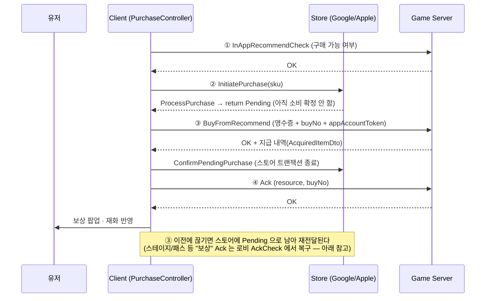

인앱 구매는 "스토어 결제"와 "게임 서버의 보상 지급"이 서로 다른 두 시스템에서 일어난다. 결제는
완료됐는데 통신 장애로 서버가 이를 못 받거나, 서버는 기록했는데 클라이언트가 응답을 못 받아 재화를
못 받는 등, 두 시스템의 상태가 어긋날 여지가 구조적으로 존재한다. STARWAY의 인앱 구매 프로토콜은
TCP의 3-way handshake에서 착안해 **①사전 확인 → ②스토어 결제 → ③결제 결과를 서버에 통보 → ④서버
Ack로 재확인** 이후에야 최종적으로 보상을 지급하도록 되어 있다 — 어느 한쪽만의 판단으로 구매를
완료 처리하지 않는다.



> 샘플 코드: [`10.IAP/PurchaseController.cs`](./10.IAP/PurchaseController.cs) (스토어 연동, Pending 처리) · 서버 통신/예외 처리 계층은 [05.Network/03.ApiException](./05.Network/03.ApiException/readme.md)

0단계 : 구매 전 서버에 상품 구매 가능 여부를 먼저 확인한다 [`NetworkManager.InAppRecommendCheck`]
```csharp
public void InAppRecommendCheck(RequestDto<StoreBuyDto> requestDto, Action<ResponseDto<CodeDto>> callback)
{
    GameStore.InAppRecommendCheck(requestDto, (response) =>
    {
        callback(response);
    });
}
```
```csharp
    public void BuyPassProduct(string sku)
    {
        Params param = (Params)this.paramBuffer;

        LoadingIndicator.Show();

        var (requestDto,_) = CommonProcessController.GetRecommendRequestDto(param.data, 0, sku, string.Empty, string.Empty);

        var networkManager = GameScene.Instance.NetworkManager;

        networkManager.InAppRecommendCheck(requestDto, (response) =>
        {
            if (response == null || (ResponseCode)response.code != ResponseCode.OK) {
                LoadingIndicator.Hide();
                return;
            }
            // ... 중략: 확인 성공 시 실제 스토어 결제(1단계)로 진행 ...
```

1단계 : Unity Purchasing Library를 활용하여 Apple, Google Store 구매 처리 진행 [`PassBuyPopup.OnClickBuy`]
```csharp
    public void OnClickBuy()
    {
        Params param = (Params)this.paramBuffer;

#if UNITY_EDITOR
        if (param.data.InAppBool)
        {
            Debug.LogWarning("UNITY_EDITOR 에서는 인앱상품을 지원하지 않습니다.");
            return;
        }
#endif
        string sku = param.data.Sku;

        this.BuyPassProduct(sku);
    }
```

2단계 : 구매 결과 정보를 자사 Server에 전달한다 [`CommonProcessController.BuyFromRecommend`]
```csharp
            PurchaseController.BuyProduct(sku, (sku, purchaseData, appAccountToken, cb) =>
            {
                // 구글, 애플 결제 완료 후 우리 게임서버로 전달.
                CommonProcessController.BuyFromRecommend(param.data, 0, sku, purchaseData, appAccountToken, cb);
            }, (buyNo, dataCode, cb) =>
            {
                // Ack 처리.
                CommonProcessController.Ack(CommonProcessController.AckType.Recommend, buyNo, dataCode, cb);
            }, (result) =>
```

3단계 : 구매 History가 클라이언트와 Server가 현재 일치하는지 서버에 재확인한다 [`NetworkManager.Ack`]
> `Ack`는 단순히 "성공/실패"만 돌려주지 않는다. 응답이 `OK`면 `requestDto.data.resource` 값(구매
> 종류)에 따라 `GameScene.unreceivedStageReward`, `unreceivedPassReward`, `unreceivedDailyBonusReward`
> 같은 "아직 확인(Ack)하지 못한 결과" 목록에서 해당 항목을 제거한다.
> 이 목록은 클라이언트가 임의로 채우는 것이 아니라 **서버가 내려주는 `UNCONFIRMED` Invoke 로 채워진다**
> (아래 "미수령 보상 복구" 참고). 서버 API(`GameHistory.Ack`) 주석에도 "결과를 확인했다는 요청하지 않을 경우 서버에서
> 지속적으로 확인하지 않은 결과가 있다는 정보를 내려보낸다"고 적혀 있다 — 즉 **Ack 를 보내지 못하면 서버가 계속 알려주고,
> Ack 가 성공해야 양쪽에서 동시에 그 항목이 사라지는** 구조다.
```csharp
public void Ack(RequestDto<HistoryDto> requestDto, Action<ResponseDto<String>> callback)
{
    GameHistory.Ack(requestDto, (response) =>
    {
        if (response != null && (ResponseCode)response.code == ResponseCode.OK)
        {
            switch (requestDto.data.resource)
            {
                case "StageRewardInfo":
                    if (GameScene.unreceivedStageReward != null)
                    {
                        var targetItem = GameScene.unreceivedStageReward.Find(x => x.value == requestDto.data.no);
                        if (targetItem != null)
                            GameScene.unreceivedStageReward.Remove(targetItem);
                    }
                    break;

                // ... 중략: DailyBonusInfo / PassInfo / Advertisement / CardGachaSon 등
                //          동일한 형태의 case가 리소스 종류별로 반복 ...

                case "PopupStore":
                    break;
            }
        }

        callback(response);
    });
}
```

4단계 : 구매 History까지 서버와 일치하면(Ack 성공) 그제서야 클라이언트의 재화/보상 반영과 이펙트를
보여주고 화면을 갱신한다 [`PassBuyPopup.BuyPassProduct` 콜백]
```csharp
            }, (result) =>
            {
                // BuyDiamond, Ack 결과에 따라 처리.
                if (result.ResponseCode == ResponseCode.OK)
                {
                    if (result.AckResponseCode == ResponseCode.OK)
                    {
                        LoadingIndicator.Hide();

                        this.Hide();
                        ViewController.OpenRewardPopup(result.AcquiredDto, () =>
                        {
                            GameStorage.ItemStorage.GetReward(result.AcquiredDto);

                            param.isBuyAvaliable = false;
                            this.price.text = (param.isBuyAvaliable) ? param.price : param.alreadyActiveText;
                            this.buyButton.interactable = param.isBuyAvaliable;

                            this.result.isOnOk = true;
                            this.Close();
                        },false,LocaleController.GetSystemLocale(614));
                    }
                    else
                    {
                        LoadingIndicator.Hide();
                        // Ack Fail.
                    }
                }
                else
                {
                    LoadingIndicator.Hide();
                    // BuyDiamond Fail.
                }
            });
```

> `result.ResponseCode`(스토어 결제 결과 전달)와 `result.AckResponseCode`(서버 재확인 결과)가 분리된
> 두 값으로 내려온다는 점이 이 흐름의 핵심이다. 구매 자체는 성공했더라도 `AckResponseCode`가 `OK`가
> 아니면 보상 지급 UI(`ViewController.OpenRewardPopup`)와 `param.isBuyAvaliable = false` 갱신이
> 실행되지 않는다 — 클라이언트가 "결제 성공"과 "보상 지급 확정"을 같은 신호로 취급하지 않는다.

스토어 쪽 안전장치 — `Pending` 반환과 "서버 확인 후에만" 트랜잭션 종료
--------------------------------------------------------------------
Unity Purchasing 의 `ProcessPurchase` 에서 소비형 상품을 `Complete` 가 아니라 **`Pending`** 으로 반환한다. 스토어 입장에서는 아직 소비가
확정되지 않은 상태이므로, 게임 서버 처리가 끝나기 전에는 트랜잭션이 종료되지 않는다.
```csharp
public PurchaseProcessingResult ProcessPurchase(PurchaseEventArgs args)
{
    ...
    if (args.purchasedProduct.definition.type == ProductType.Consumable)
    {
        if (PurchaseController.IsPurchaseStart)          // 유저가 방금 상점에서 시작한 구매
            CoroutineTaskManager.AddTask(PurchaseController.Instance.ProcessPurchaseComplete(sku, transactionId, receipt));
        else                                             // 이전 세션에서 끝나지 못한 구매가 재전달된 경우
            this.PendingProduct = new PendingProductInfo(sku, transactionId, receipt);

        return PurchaseProcessingResult.Pending;
    }
    ...
}
```
```csharp
private IEnumerator ProcessPurchaseComplete(string sku, string transactionID, string receipt)
{
    ...
    yield return ProcessToServer(sku, purchaseData, null);              // ③ 서버에 영수증 전달

    if (purchaseResult.ResponseCode == ResponseCode.OK)                 // 서버가 지급을 확인한 뒤에만
    {
        StoreController.ConfirmPendingPurchase(StoreController.products.WithID(sku));   // 스토어 트랜잭션 종료
        if (PlayerPrefs.HasKey(sku)) PlayerPrefs.DeleteKey(sku);        // iOS appAccountToken 정리
        ...
        yield return ProcessToServerAck(purchaseResult.buyNo, purchaseResult.dataCode);  // ④ Ack
    }
    onPurchaseResultCallback(purchaseResult);
}
```
> 서버가 `OK` 를 주지 않으면 `ConfirmPendingPurchase` 가 호출되지 않아 **결제 건이 스토어 쪽에 Pending 으로 남는다.** 결제는 됐는데 서버
> 처리가 실패한 경우를 "없던 일"로 만들지 않고, 재전달 가능한 상태로 보존하는 것이 이 구조의 목적이다. 이때 재전달된 결제는
> `IsPurchaseStart == false` 경로를 타고 `PendingProductInfo` 로 보관된다 (`PurchasingFinishTransaction` 이 이를 이어서 처리하는 진입점).
> iOS 는 구매 시작 시 `appAccountToken`(GUID)을 만들어 스토어에 `SetApplicationUsername` 으로 등록하고 `PlayerPrefs` 에 sku 별로 저장해,
> 재전달된 영수증과 원래 구매 요청을 다시 연결할 수 있게 한다.

미수령 보상 복구 — 로비의 AckCheck 상태
--------------------------------------
결제와 별개로 스테이지 클리어 보상, 일일/패스 보상, 광고 보상, 카드 가챠 보상도 같은 "Ack" 규약을 쓴다 (`NetworkManager.Ack` 의 `switch` 가 다루는
리소스가 바로 이 다섯 가지이고, 상점 결제 리소스는 이 복구 목록에 포함되지 않는다 — 결제는 위 `Pending` 으로 보호한다). 인게임에서 클리어 보상 Ack 를 처리하지
않고 나가버리는 경우(앱 종료, 강제 이탈, 통신 단절)가 있어서, 커밋 `e581a7ddd` **"인게임에서 클리어 보상 ACK 처리를 하지 않고 빠져나가는 경우 로비에서
Invoke 정보를 이용하여 미수령한 클리어 보상을 처리하도록 수정함"** 으로 복구 경로를 추가했다.

**1) 서버가 알려준다 — Invoke 누적 (`GameScene`)**
```csharp
SBHttp.AddInvokeListener(InvokeKind.UNCONFIRMED, this.AccumulateUnConfirmedInvokes);
SBHttp.AddInvokeListener(InvokeKind.DAILY_EVENT, this.AccumulateUnreceivedDailyReward);
SBHttp.AddInvokeListener(InvokeKind.PASS,        this.AccumulateUnreceivedPassReward);

public static List<InvokeDto> unreceivedStageReward;
public static List<InvokeDto> unreceivedPassReward;   // ... DailyBonus / AD / CardGacha / Etc

private void AccumulateUnConfirmedInvokes(InvokeDto invokeDto)
{
    if (unreceivedStageReward == null) unreceivedStageReward = new List<InvokeDto>();
    if (invokeDto.resource == "StageRewardInfo")
    {
        bool isAlreadyExist = unreceivedStageReward.ToList().Exists(x => x.value == invokeDto.value);
        if (!isAlreadyExist)                                    // 같은 Invoke 가 반복돼도 한 번만 쌓는다
            unreceivedStageReward.Add(invokeDto);
    }
    ...
}
```
**2) 로비가 정리한다 — 상태 머신의 `AckCheck` 단계 (`LobbyScene`)**

로비 진입 절차는 `STATE` enum(`ResizingCanvas → UpdatePlayerInfo → ... → UpdateStageButton → AckCheck → CheckTutorialVideo → Done`)으로 순서가
고정돼 있고, `AckCheck` 단계에서 `RequestUnreceivedRewards()` 를 실행한다. 로비의 다른 초기화가 끝난 **뒤에**, 튜토리얼 영상 확인 **앞에** 복구가 끼어든다.
```csharp
IEnumerator Task()
{
    yield return RequestUnreceivedStageRewardTask();
    yield return RequestUnreceivedDailyRewards();
    yield return RequestUnreceivedPassRewards();
    yield return RequestUnreceivedADRewards();
    yield return RequestUnreceivedCardGachaRewards();
    this.StateChange(STATE.CheckTutorialVideo);                // 전부 끝나야 다음 단계로
}

IEnumerator RequestUnreceivedStageRewardTask()
{
    List<InvokeDto> copiedList = new List<InvokeDto>(GameScene.unreceivedStageReward);   // 순회 중 수정 방지용 복사
    foreach (var invokeDto in copiedList)
    {
        bool isFinished = false;
        HistoryDto dto = new HistoryDto("StageRewardInfo", invokeDto.value);
        ...
        GameHistory.Ack(historyRequestDto, (ackResponse) =>                 // ① 확인했다고 서버에 응답
        {
            if (ackResponse != null && (ResponseCode)ackResponse.code == ResponseCode.OK)
            {
                GameHistory.Check(historyRequestDto, responseDto =>         // ② 서버가 처리해 둔 결과를 조회
                {
                    if (responseDto != null && (ResponseCode)responseDto.code == ResponseCode.OK)
                    {
                        GameScene.unreceivedStageReward.Remove(...);         // 목록에서 제거
                        GameStorage.ItemStorage.GetReward(responseDto.data); // ③ 클라이언트에 보상 반영
                    }
                    isFinished = true;
                });
            }
            else isFinished = true;
        });
        yield return new WaitUntil(() => isFinished);                        // 항목을 하나씩 직렬 처리
    }
}
```
> 서버가 이미 지급 처리를 끝낸 결과를 **`Check` 로 조회해서 반영**하기 때문에, 클라이언트가 "보상을 다시 계산해서 지급"하는 일은 없다. 복구 경로가
> 아무리 여러 번 실행돼도 지급의 주체는 서버 하나로 유지된다. 항목은 하나씩 `WaitUntil` 로 직렬 처리해서 통신 경합을 피하고, 각 단계가
> 실패하면 그 항목만 목록에 남아 다음 로비 진입 때 다시 시도된다.

설계 포인트
------------
> 이 4단계 구조에서 가장 중요한 지점은 3단계 `Ack`다. 구매 확정을 "스토어 결제 성공" 한 번의 신호로
> 끝내지 않고, 서버가 자신의 구매 이력과 클라이언트가 보고한 이력이 서로 일치하는지 재확인한 뒤에야
> `unreceivedXXXReward` 목록에서 항목을 지우고 클라이언트도 보상 UI를 띄운다. TCP의 3-way handshake와
> 같은 아이디어로, 한쪽의 판단만으로 거래를 종료하지 않고 양쪽 상태가 맞아떨어지는 것을 확인한 뒤에야
> 완료 처리하는 구조다.   
> 이 구조는 두 영역을 서로 다른 방식으로 보호한다. **결제**는 스토어 쪽에서 서버가 `OK` 를 줄 때까지 `Pending` 을 유지해 트랜잭션을 종료하지 않고,
> 서버 처리 이후에도 `Ack` 가 성공해야 클라이언트가 보상 UI 를 띄운다. **보상(스테이지 클리어/패스/일일/광고/카드 가챠)** 은 서버가 `Ack` 를 받기
> 전까지 `UNCONFIRMED` Invoke 로 "확인되지 않은 결과"를 계속 알리고, 클라이언트는 로비 `AckCheck` 단계에서 `Ack → Check → 반영` 순서로 정리한다.
> 앱이 종료되거나 통신이 끊겨도 "처리는 됐는데 못 받았다"는 상태를 다음 접속에서 되살릴 수 있는 이유다.   
> 이 Ack 확인 단계를 구매 프로토콜에 넣은 이후, 결제는 됐는데 보상을 못 받았다거나 반대로 서버와
> 클라이언트의 구매 상태가 어긋나는 유형의 라이브 이슈로 인한 CS 문의가 주 1~3건 수준에서 사실상
> 0건으로 줄었다 (운영 중 CS 접수 집계 기준) — 결제 신뢰성 문제로 인한 운영 부담이 눈에 띄게 줄어든 부분이다.

한계와 개선 방향
------------------
> * `NetworkManager.Ack` 와 로비의 `RequestUnreceived*` 는 리소스 종류(`StageRewardInfo`, `PassInfo`, `Advertisement` …)마다 거의 같은 코드가
>   반복된다. `resource 이름 → 목록` 매핑 테이블과 하나의 제네릭 복구 루틴으로 합칠 수 있는 부분이다.
> * `Etc`(그 외) 보상 복구는 QA 부담 때문에 코드에 주석 처리된 채 남아있다 (`// 사용가능 한 부분이지만 QA가 필요한 부분이라 일단 주석`). 일부러 범위를
>   좁혀서 배포한 결정이다.
> * 결제 로직이 코루틴 + 콜백 조합이라 흐름이 눈에 잘 들어오지 않는다. 퍼즐 로직에서 했던 것처럼 UniTask 로 옮기면 위 시퀀스 다이어그램과 코드의
>   모양을 거의 1:1 로 맞출 수 있다.
> * 이 문서는 **클라이언트 쪽 프로토콜**을 다룬다. 영수증 검증과 중복 지급 방지 자체는 서버의 책임이며, 클라이언트는 `buyNo`(상품별 누적 구매 횟수 + 1),
>   요청 GUID, 서버 시각을 요청에 실어 서버가 판단할 근거를 제공한다.

관련 코드: [PopupUIPattern.md](https://github.com/seojoonyboy/SampleCodes/blob/main/02.UnityProjects/02.StarwaySeries/PopupUIPattern.md) · [99.Pattern](https://github.com/seojoonyboy/SampleCodes/tree/main/02.UnityProjects/99.Pattern) · [05.Network](https://github.com/seojoonyboy/SampleCodes/tree/main/02.UnityProjects/02.StarwaySeries/05.Network) · [10.IAP](https://github.com/seojoonyboy/SampleCodes/tree/main/02.UnityProjects/02.StarwaySeries/10.IAP)
